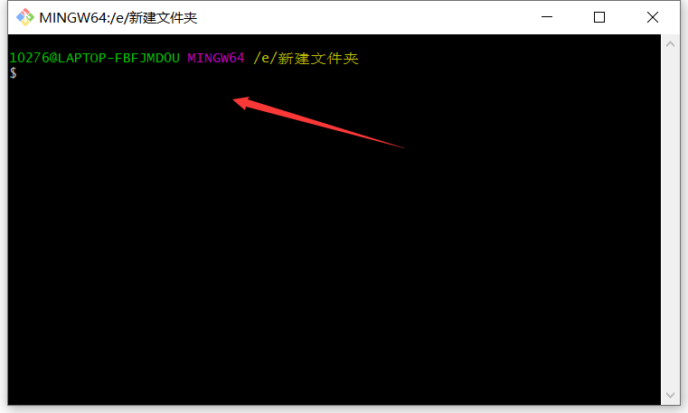
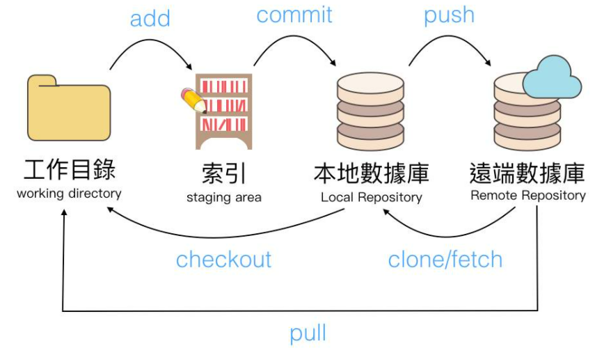
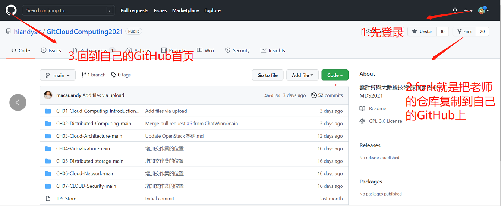
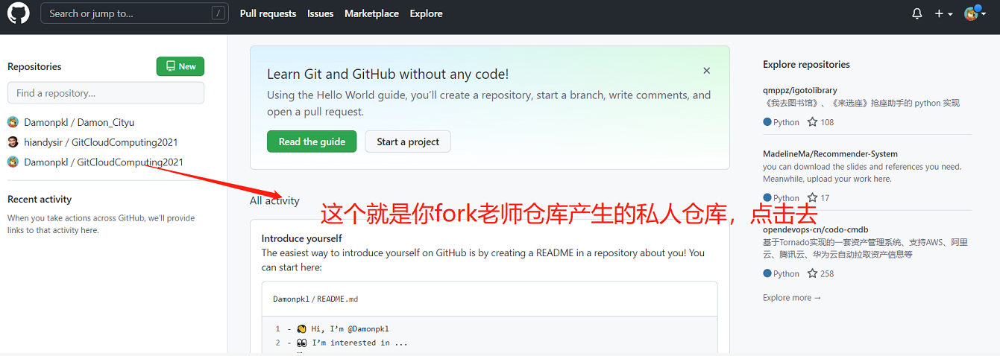
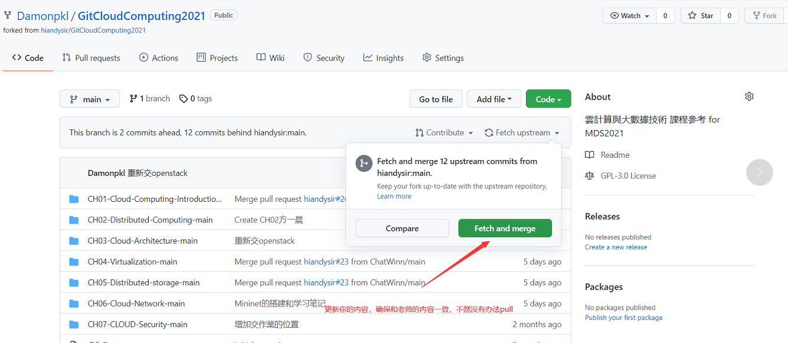
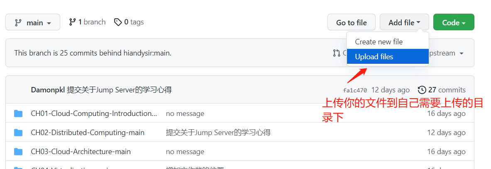
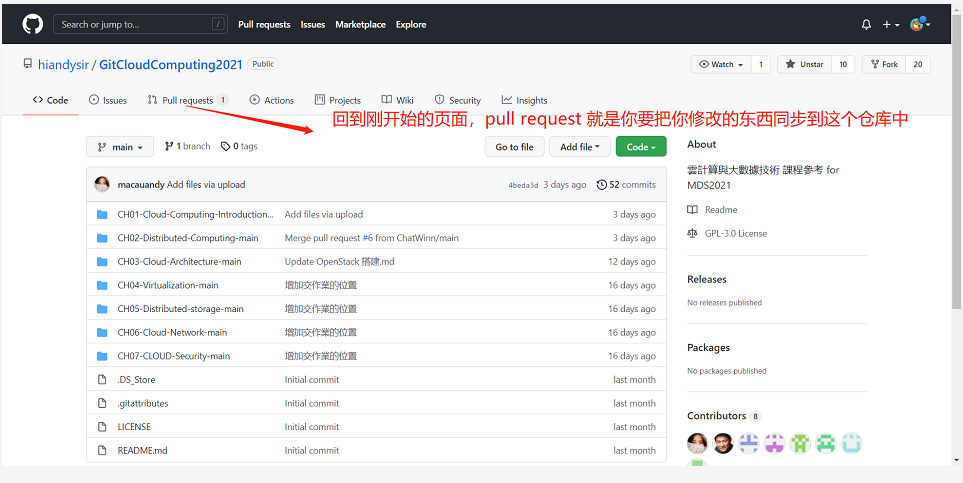
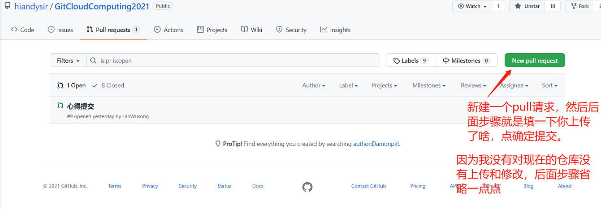

# Github的使用

author:Damon

**网页版操作github**

课上老师推荐的教程是命令行格式，使用gitbash

**个人推荐可以使用网页版操作github，易于操作，后文有详细的步骤流程**

老师推荐的Git bash学习视频，应该尝试将代码敲一遍，

主要就是图文来熟悉GitHub的基本流程。

后期使用网页或者图形化界面sourcetree其实也十分方便

### 网页版github

直接上教程：

