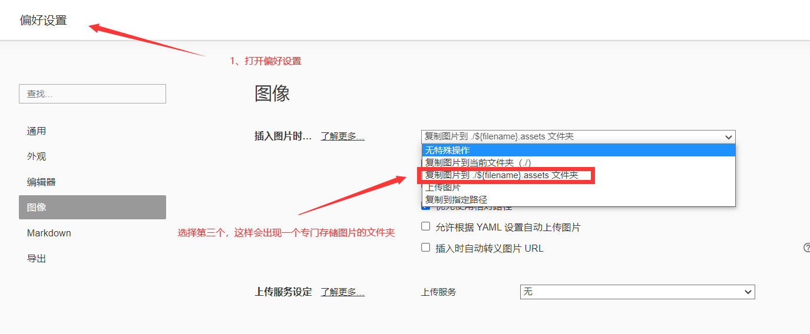
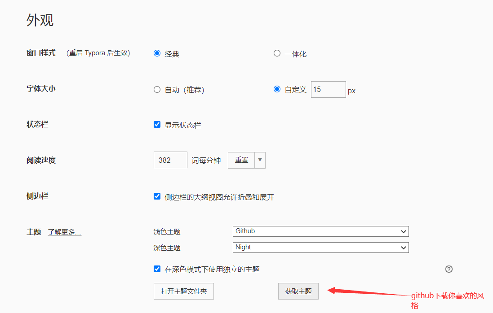
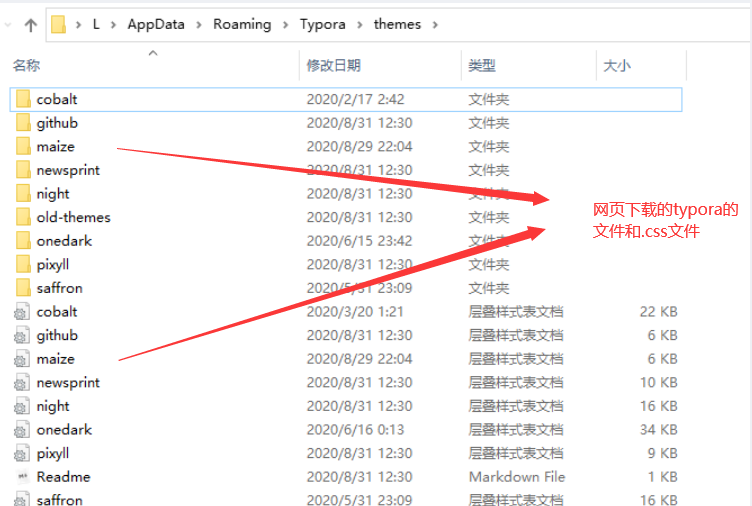

# 脑图和Typora的使用心得

author:Damon

脑图是一个整理思路，理清头绪非常好用的一款软件,Typora则是一款记笔记十分方便的软件。

本文是学期过了一大半开始写的心得，期间也多次使用脑图和Typora来学习。使用后的感受也是十分不错。

### 如何阅读文献的过程和方法：

简单说一说个人的阅读过程：

首先主要就是说一说自己使用脑图，和文献翻译的使用。

**没有打广告!!**

平时做文献翻译，除了使用老师推荐的**deepl**软件翻译，我还经常使用**小绿鲸翻译器**进行管理和阅读文献（收费，100元）。

上一周图书馆的老师推荐了一个叫**endnote**的软件，据说很好用，目前还在学习使用中，这个软件可以批量下载文献，对文献分组管理。

对文献翻译后，阅读后可以使用脑图进行文章的思路分析。

具体方法可以看老师推荐的两篇文献：

- S. Keshav, **How to Read a Paper**, ACM SIGCOMM Computer Communication Review, 2013, 37(3): 83-84.
- Philip W. L. Fong, **Reading a Computer Science Research Paper**, ACM SIGCSE Bulletin, 2009, 41(2): 138-140.

脑图主要是个人思路的一种体现，最重要的是帮助自己方便快速回忆该篇论文的内容

其次是Typora的使用，Typora其实就是一个可以编辑的网页，其中渲染功能都能使用前端语言进行修改。页面也是相对整洁。

那下文就说一下关于Typora的自己常用的**设置和一些小技巧**：

### 如何保存一张图片：

### 如何更换风格：

重新打开typora即可选择新的主题。

