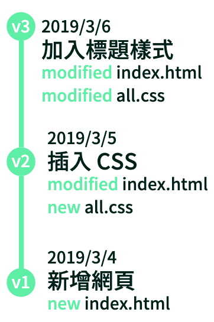
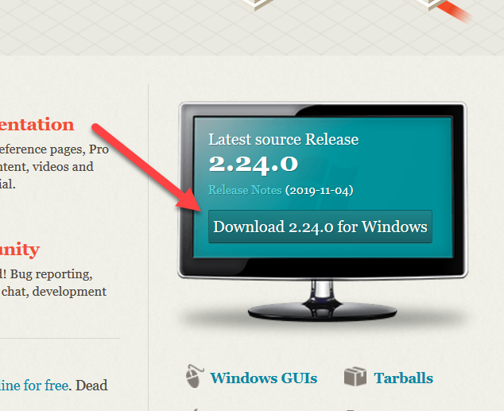
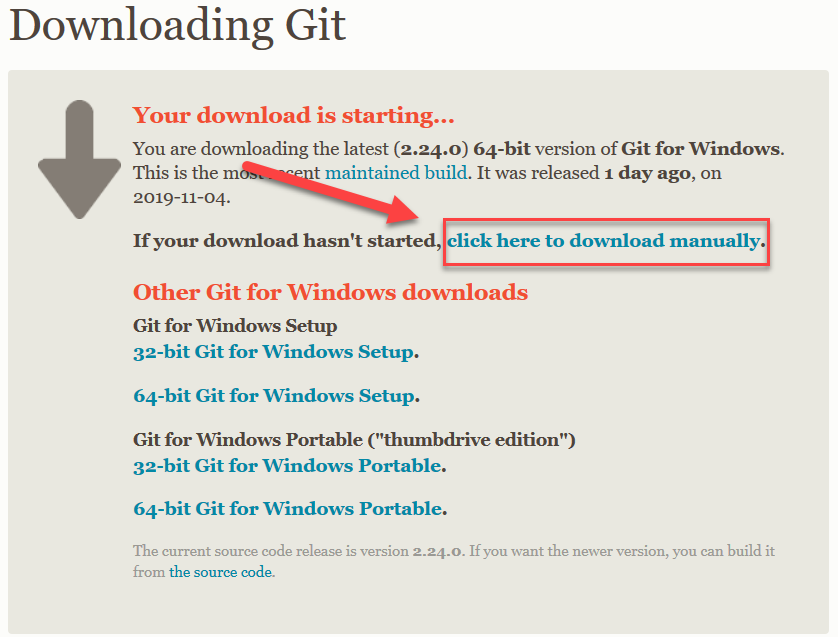
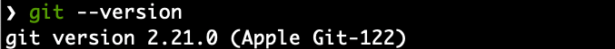
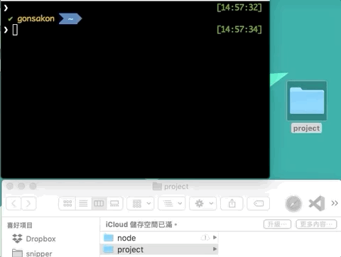
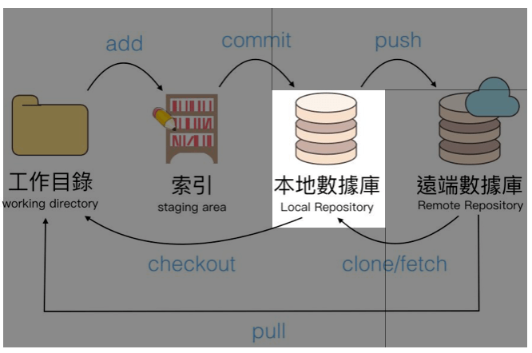
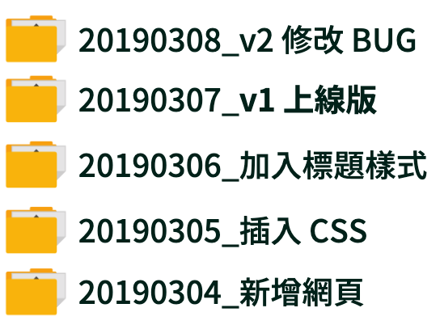
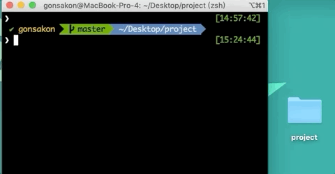

# gGit & GitHub 入門

## 下一堂

* 遠端伺服器管理與操作
* 常見指令教學 (還原、查看歷史紀錄)

## 為什麼要學 Git ？

* Git 是程式碼版本控制軟體
* 用網頁版型介紹用了 Git 的差異


## Git 是什麼？版本控制是什麼？

Git 是一個分散式版本控制軟體，我們先聊聊何謂版本控制。

## 什麼是版本控制

版本控制能夠記錄檔案的內容變化，並且能夠查詢每個版本所更動的內容。這裡我們就以**一位網頁設計師的開發過程當例子**吧。

傳統要做版本控制，絕大部分都會像是下圖，用資料夾來去版本控制，但這樣的壞處是，我們根本**不知道裡面到底哪些檔案有更動過**。


但如果使用版本控制的話，以上問題都可以解決。在 Git 的世界裡，**上圖的每個資料夾都可以視為一個版本**，且能夠記錄每個版本修改了哪些檔案，如下圖。



你可以很輕易看出來，每個版本新增 (new) 、編輯(modified)了哪些檔案。

像是 v1 的版本，版本說明是「新增網頁」，同時也會記錄他在專案上新增了一個 HTML 檔。而在 v3 版本上，可以看到他沒新增檔案，但卻針對 index.html、all.css 去做了編輯動作，有可能他在 HTML 插入了一個 h1 標籤，並且在 CSS 裡新增了 h1 的樣式。

這就是 Git 的好處，它甚至能看到開發者改了哪幾行 CODE 都一清二楚，同時也會顯示該版本是哪位開發者更新的，在團隊開發與溝通上，藉由觀察 Git 上的更新就順暢多了。

## 軟體與服務安裝

* [Git 軟體安裝](https://git-scm.com/) - 首頁 Download
* [Github 會員註冊](https://github.com/)
* [SourceTree 軟體安裝](https://www.sourcetreeapp.com/)


## Window 文字版安裝 Git 流程

1. 連結到 [Git 官網](https://git-scm.com/)   https://gitforwindows.org/
2. 首頁就有**下載 Git 按鈕**，官網會依照你的版本提供給你對應版本，點擊進行下載
3. 下載後啟動執行檔，一路下一步即可完成安裝

## Window 圖片版安裝 Git 流程

#### 步驟一：連結到 [Git 官網](https://git-scm.com/)，首頁會有**下載 Git 按鈕**，如下圖箭頭紅框處。



#### 步驟二：官網會跳轉下載頁面，並自動下載，若沒有自動觸發，可點選下圖連結位置手動下載。轉址過去過幾秒就會自動下載。



## 如何確保安裝成功？

### 步驟一：按下鍵盤上的 `Window + S 按鍵` 呼叫搜尋功能

### 步驟二：輸入關鍵字「命令提示字元」、「PowerShell」或「Git Bash」，尋找到對應軟體後，按下 Enter

### 步驟三：複製此指令「`git --version`」，並在終端機點選滑鼠右鍵，選擇「Paste」貼上後，按 Enter

如果系統有回饋你安裝的版本編號，就恭喜你安裝成功了


## 終端機

* Win：**Git Bash**
    * 開始 > 搜尋輸入 > Git Bash
* Mac：**終端機**
    * 輸入「control + 空白」，關鍵字輸入「終端機」

## 終端機指令學習

* 練習：前往到某資料夾，觀看內容

* 練習：嘗試用指令開一個新資料夾或檔案

  

|Windows	|MacOS / Linux	|說明	|
|---	|---	|---	|
|cd [路徑]	|cd [路徑]	|前往資料夾路徑	|
|---	|---	|---	|
|cd	|pwd	|取得目前所在的位置	|
|dir	|ls	|顯示資料夾裡的檔案	|
|mkdir	|mkdir	|新增資料夾	|
|無指令	|touch	|開新檔案	|
|copy	|cp	|複製檔案	|
|move	|mv	|移動檔案	|
|del	|rm	|刪除檔案	|
|cls	|clear	|清除畫面上的內容	|

## 嘗試 Git 是否有安裝成功

* 在終端機裡面輸入：git --version
* 


## 設定個人資料

* 輸入姓名：`git config --global user.name "gon"`
* 輸入個人的 email：`git config --global user.email "gonsakon@gmail.com"`
* 查詢 git 設定內容：`git config --list`


## 基本指令架構


## 如何開始操作 Git？

要開始用 Git 時，一開始得必須學習如何建立 Git Repository，中文名稱翻譯有幾個版本，例如`儲存庫`、`數據庫`，以下則都簡稱為數據庫。

除了建立本地端數據庫外，本章節後面也會講解如何建立遠端數據庫，代表性服務則有 GitHub、Bitbucket。

先從「`建立本端數據庫`」開始

## git init (新建數據庫)

想要開始學 Git，首先學習該如何在自己的專案上新增一個數據庫(Repository)。

請先在自己電腦上操作以下步驟：

1. 在你電腦上新增一個資料夾
2. 透過 cd 前往該資料夾
3. dir執行 `git init` 指令

執行完後，若顯示以下回饋，就表示您建立**本地數據庫**成功。

```undefined
$ git init
Initialized empty Git repository in "專案路徑"/.git/
```

這指令主要就是會在你的資料夾建立一個 `.git` 資料夾，任何版本控制項目都會透過它進行監視版控。



如果您看到在指定資料夾上，有顯示 `.git` 隱藏資料夾，表示您**新增本地數據庫**成功



在前面講解 Git 的時候，有提到以往在還沒有 Git 時，都會單純複製一份資料夾來版本控制，像是下圖。



那麼接下來，我們就來透過 Git 指令來新增版本吧：

1. 版本一：新增一個 index.html
2. 版本二：新增一個 all.css，並套用在 index.html

## 版控流程

1. 開新資料夾，`git init` 建立數據庫
2. 新增一個 `index.html` 檔案

這時，您可以輸入 `git status` 指令去查看，如下圖指令。



會獲得此回饋：

_(1)1ht4jz.png)

你可以看到 `Untracked files` 的檔案有 `index.html`，Untracked 的意思是，Git 偵測到你有新增這筆檔案，但尚未是 Git 追蹤的對象。

所以必須先將它加入到 staging area(索引)裡，就可以將 `index.html` 加入到追蹤對象。

那麼要如何將檔案加入到索引呢？指令是：

```undefined
git add <檔案名稱>
```

以本案例來說，就必須用`git add index.html` 來加入索引。

> 如果要一口氣將全部檔案加入索引，可以用 `git add .`

加入索引後，可以再次輸入 `git status` 觀看，會得到下圖回饋

1i4n6v.png)

您會發現該檔案狀態本來是 `Untracked files`，變成是`Changes to be committed`，這樣就表示有成功加入到索引。

`Changes to be committed`的意思是，放在索引的檔案即將會被提交成一個新版本(commit)。

此時我們可以透過以下指令，來提交一個新版本。

```undefined
git commit -m "<填寫版本資訊>"
```

所以這裡我就輸入`git commit -m "新增網頁"`來提交版本後，系統如果回饋以下訊息，就恭喜你，你透過 Git 建立出第一個版本出來了。

```
❯ git commit -m "新增網頁"
[master (root-commit) b6c3c77] 新增網頁
 1 file changed, 0 insertions(+), 0 deletions(-)
 create mode 100644 index.html
```

您可以再次使用 `git status` 觀察，會獲得以下資訊：

```undefined
On branch master
nothing to commit, working tree clean
```

因為你已經將剛剛的`index.html`提交成一個版本(commit)，所以目前工作目錄上已經清空。

## 查訊版本

那麼我們要如何觀看新增的版本呢？你可以使用以下指令：

```undefined
git log
```

假使你有看到一個版本更新紀錄，表示你成功了！

```undefined
commit b6c3c771cd8939bcd25a8c50089fdf0cd3eab98d (HEAD -> master)
Author: 您的姓名 <您的 Email>
Date:   您的版本更新時間

    新增網頁
```

若要退出，請鍵入小寫 `q`。

## 接下來換您新增一個版本

這裡我簡化本篇流程：

1. 開新資料夾，`git init` 建立數據庫
2. 新增一個 `index.html` 檔案
3. 加入索引：`git add .`
4. 提交版本：`git commit -m "新增網頁"`
5. 觀看歷史紀錄：`git log`，並會看到一個版本紀錄

那麼該如何新增第二個版本呢？因為我們已經新增好數據庫了，所以已經不需要再新增一次，推薦步驟如下：

1. 新增一個 `all.css`，並編輯`index.html`，插入該 CSS
2. 全部加入索引：`git add .`
3. 提交版本：`git commit -m "插入 CSS"`

最後你可以再透過 `git log` 觀看是否數據庫裡面會有兩個版本。


## Git 常用指令

* 初始化數據庫： `git init`
* [開啟 .git 隱藏檔方案](https://helpx.adobe.com/tw/x-productkb/global/show-hidden-files-folders-extensions.html)
    * Mac command+shift+.
* 查詢當前狀態：`git status`
    * 要將檔案加入到指定資料夾
* 將檔案加入到索引：`git add .`
* 將索引檔案變成一個更新(commit)：`git commit -m "新增網頁環境"`
* 觀察 commit 歷史紀錄： `git log`
* 下載遠端數據庫： `git clone 數據庫網址`
* 更新遠端數據庫： `git push origin master`

## git 檔案追蹤機制


究竟 Git 是如何追蹤檔案變化的呢？我們藉由上圖來帶入一個情境：

1. 當我們建立數據庫後，立即新增一個檔案時，用 `git status` 查詢，會發現它是在 `Untracked` 狀態。
2. 這就表示此檔案還沒進到版本控制，藉由 `git add .` 將檔案加入到索引 (Staged) 後，準備提交成一個 commit 版本。
3. 藉由 `git commit -m <提交訊息>` 後，該檔案就會開始被追蹤，檔案狀態就會變成 `UnModified` 狀態。

視頻複習：https://youtu.be/mCzptNYsE30

1.這裡有幾個未被追蹤的檔案
2.有幾個未被加入索引
3.幾個已加入索引的檔案


1.這裡有幾個未被追蹤的檔案
2.有幾個未被加入索引
3.幾個已加入索引的檔案


## Sourcetree 軟體操作教學

https://youtu.be/qAowFThM50c

## GitHub Pages - 建立靜態網站

https://youtu.be/QF00ThvS688

