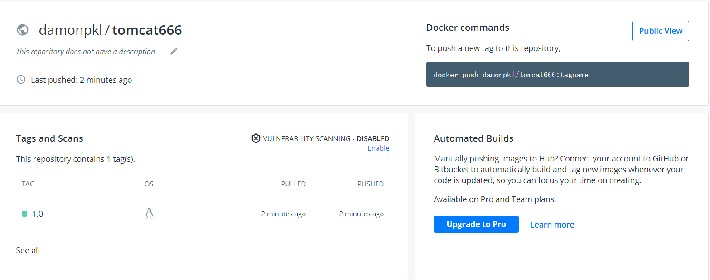
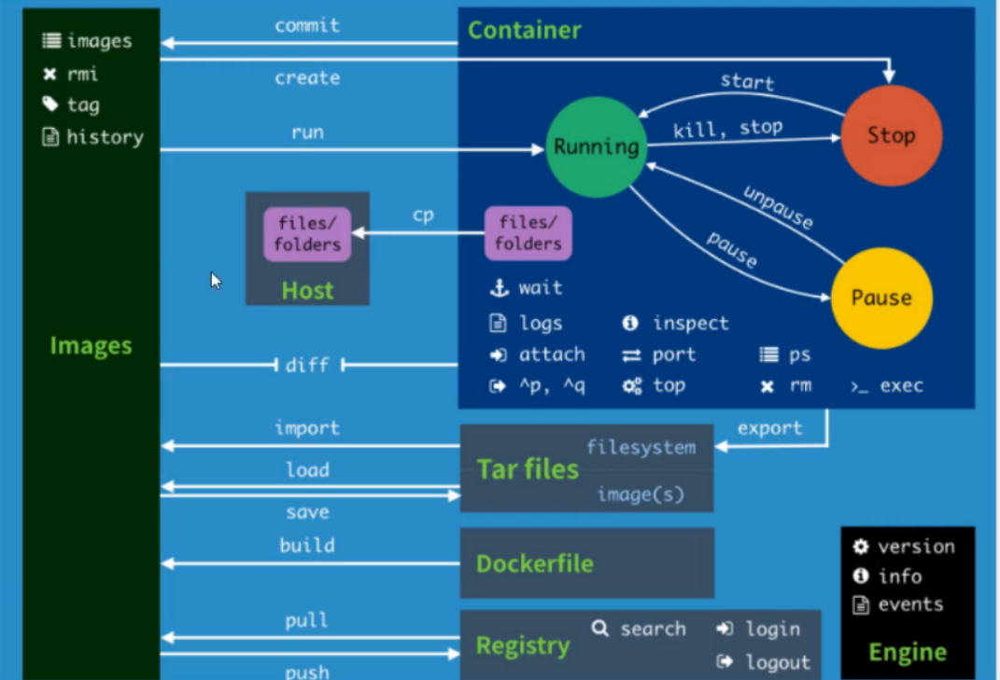
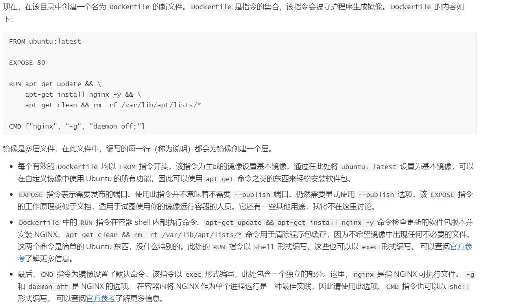
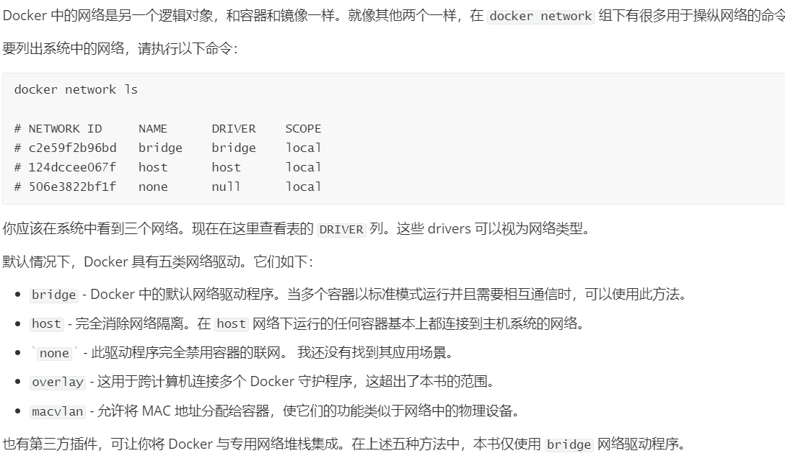
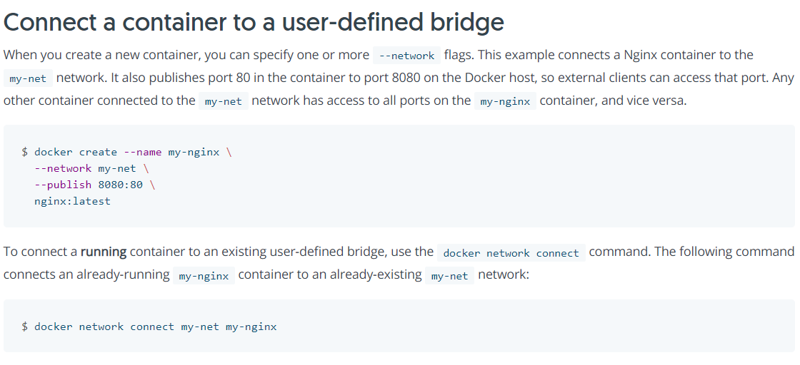

# Docker的搭建和学习笔记

author:Damon

参考官方文档：https://docs.docker.com/desktop/

参考学习文档：Docker 入门教程 - 2021 最新版[#DOCKER](https://chinese.freecodecamp.org/news/tag/docker/)


### Docker的安装过程：

#### 将dockers安装到ubuntu

```shell
#清除已安装环境(新系统可跳过)
apt-get remove docker docker-engine docker.io containerd runc
#安装依赖包
apt-get update
apt-get install \
    apt-transport-https \
    ca-certificates \
    curl \
    gnupg \
    lsb-release
#添加Docker官方密钥
curl -fsSL https://download.docker.com/linux/ubuntu/gpg | sudo gpg --dearmor -o /usr/share/keyrings/docker-archive-keyring.gpg
#设置安装稳定版Docker
echo \
  "deb [arch=amd64 signed-by=/usr/share/keyrings/docker-archive-keyring.gpg] https://download.docker.com/linux/ubuntu \
  $(lsb_release -cs) stable" | sudo tee /etc/apt/sources.list.d/docker.list > /dev/null
#安装Docker
apt-get update
apt-get install docker-ce docker-ce-cli containerd.io
#查看Docker版本
[root@Damonsjkx ~]# docker --version
Docker version 20.10.9, build c2ea9bc
```


#### 测试Docker使用hello-word

```shell
[root@Damonsjkx ~]# docker run hello-world
...
Hello from Docker!
This message shows that your installation appears to be working correctly.
...

[root@Damonsjkx ~]# docker images
REPOSITORY    TAG       IMAGE ID       CREATED       SIZE
hello-world   latest    feb5d9fea6a5   3 weeks ago   13.3kB
```

### Docker 命令

#### Docker帮助命令

##### 基本命令

```shell
docker version # 显示docker的基本信息
docker info # 系统信息，镜像和容器的数量
docker 命令 --help # 全部信息
```

##### 简单测试

```shell
[root@Damonsjkx /]# docker version
Client: Docker Engine - Community
 Version:           20.10.9
 API version:       1.41
 Go version:        go1.16.8
 Git commit:        c2ea9bc
.
 
 [root@Damonsjkx /]# docker info
Client:
 Context:    default
 Debug Mode: false
 Plugins:
  app: Docker App (Docker Inc., v0.9.1-beta3)
  buildx: Build with BuildKit (Docker Inc., v0.6.3-docker)
  scan: Docker Scan (Docker Inc., v0.8.0)

Server:
 Containers: 1
  Running: 0
  Paused: 0
  Stopped: 1
 Images: 1
 
[root@Damonsjkx /]# docker version --help

Usage:  docker version [OPTIONS]

Show the Docker version information

Options:
  -f, --format string       Format the output using the given Go template
      --kubeconfig string   Kubernetes config file


```

------


#### Docker镜像命令

！！！！！docker的镜像不是最新版就是最好的，最新版往往很多bug

##### 基本命令

```shell
docker images #查看所有本地主机上的镜像
docker search #搜索仓库中的镜像，相当于网页搜索
docker pull   #下载镜像
docker rmi    #删除镜像
```

##### 简单测试

```shell
[root@Damonsjkx /]# docker images
REPOSITORY    TAG       IMAGE ID       CREATED       SIZE
hello-world   latest    feb5d9fea6a5   3 weeks ago   13.3kB

#比方说下载一个MySQL的镜像
[root@Damonsjkx /]# docker search mysql
NAME                              DESCRIPTION                                     STARS     OFFICIAL   AUTOMATED
mysql                             MySQL is a widely used, open-source relation…   11547     [OK]       
mariadb                           MariaDB Server is a high performing open sou…   4395      [OK]       
mysql/mysql-server                Optimized MySQL Server Docker images. Create…   854                  [OK]
phpmyadmin                        phpMyAdmin - A web interface for MySQL and M…   347       [OK]       

[root@Damonsjkx /]# docker pull mysql
Using default tag: latest
latest: Pulling from library/mysql
b380bbd43752: Pull complete 
f23cbf2ecc5d: Pull complete 
30cfc6c29c0a: Pull complete 
b38609286cbe: Pull complete 
8211d9e66cd6: Pull complete 
2313f9eeca4a: Pull complete 
7eb487d00da0: Pull complete 
4d7421c8152e: Pull complete 
77f3d8811a28: Pull complete 
cce755338cba: Pull complete 
69b753046b9f: Pull complete 
b2e64b0ab53c: Pull complete 
Digest: sha256:6d7d4524463fe6e2b893ffc2b89543c81dec7ef82fb2020a1b27606666464d87
Status: Downloaded newer image for mysql:latest
docker.io/library/mysql:latest

[root@Damonsjkx /]# docker images
REPOSITORY    TAG       IMAGE ID       CREATED        SIZE
mysql         latest    ecac195d15af   12 hours ago   516MB
hello-world   latest    feb5d9fea6a5   3 weeks ago    13.3kB
[root@Damonsjkx /]# docker rmi mysql
Untagged: mysql:latest
Untagged: mysql@sha256:6d7d4524463fe6e2b893ffc2b89543c81dec7ef82fb2020a1b27606666464d87
Deleted: sha256:ecac195d15afac2335de52fd7a0e34202fe582731963d31830f1b97700bf9509
Deleted: sha256:451fe04d80b84c0b7aca0f0bbdaa5de7c7ac85a65389ed5d3ed492f63ac092e2
Deleted: sha256:814cbf8bc7f6bb85685e5b803e16a76406c30d1960c566eee76303ffac600600
Deleted: sha256:735f72e1d1b936bb641b6a1283e4e60bf10a0c36f8244a5e3f8c7d58fa95b98a
Deleted: sha256:f2d209a30c3950fadffb2d82e1faa434da0753bee7aacad9cdec7d8a7a83df37
Deleted: sha256:03b9f8c5331d9534d2372a144bcffc8402e5f7972c9e4b85c634bef203ec6d20
Deleted: sha256:80f5487a88b8061855e99782979ed6069a8dd1c7dfbb1eb63fe42a4a9d119436
Deleted: sha256:f791a6c727931d41c51f8bf24ee32a4dbf0169f372b174f1ff89b4836b97c48e
Deleted: sha256:4c88df098412e11a98936509f3cede57f87154b350b0f75d96713f6e1dd56101
Deleted: sha256:fdba3a2cd286d9a5f65fc00f5254048855ae7dc00f3b3fa3356981eb9a7fe6d0
Deleted: sha256:8b3a69042e0da82429d28be0c474e73290ba4908730de22b2200a7aac9b245bd
Deleted: sha256:90afe56a0643f5bf1b1e8ee147b40a8e12b3fdd7e26bc2d2c50180d68dd524d0
Deleted: sha256:e81bff2725dbc0bf2003db10272fef362e882eb96353055778a66cda430cf81b
[root@Damonsjkx /]# docker images
REPOSITORY    TAG       IMAGE ID       CREATED       SIZE
hello-world   latest    feb5d9fea6a5   3 weeks ago   13.3kB
```


------

#### Docker容器命令

！！！！！有了镜像才能创建容器

```shell
docker pull centos #下载一个centos镜像
```

##### 进入、查看、退出容器

```shell
# 进入
docker run -it centos /bin/bash 
# 查看目录
ls
# 退出
exit
```

##### 查看运行的容器

```shell
# 查看正在运行的容器
docker ps
```

##### 删除容器

```shell
docker rm 容器id # 删除指定容器 
```

##### 启动和停止容器

```shell
docker start   #启动
docker restart #重启
docker stop    #停止
docker kill    #强制停止
ctrl+p+q       #不停止退出
```

##### 简单测试

```shell
[root@Damonsjkx /]# docker pull centos
Using default tag: latest
latest: Pulling from library/centos
a1d0c7532777: Pull complete 
Digest: sha256:a27fd8080b517143cbbbab9dfb7c8571c40d67d534bbdee55bd6c473f432b177
Status: Downloaded newer image for centos:latest
docker.io/library/centos:latest
[root@Damonsjkx /]# docker run -it centos /bin/bash
[root@215048748c36 /]# ls
bin  dev  etc  home  lib  lib64  lost+found  media  mnt  opt  proc  root  run  sbin  srv  sys  tmp  usr  var
[root@215048748c36 /]# exit
exit
[root@Damonsjkx /]# docker ps
CONTAINER ID   IMAGE     COMMAND   CREATED   STATUS    PORTS     NAMES
[root@Damonsjkx /]# docker rm 215048748c36
215048748c36
[root@Damonsjkx /]# docker ps
CONTAINER ID   IMAGE     COMMAND       CREATED          STATUS          PORTS     NAMES
9f2f5e4430a2   centos    "/bin/bash"   21 seconds ago   Up 20 seconds             mycentos
[root@Damonsjkx /]# docker stop 9f2f5e4430a2
9f2f5e4430a2
[root@Damonsjkx /]# docker ps
CONTAINER ID   IMAGE     COMMAND   CREATED   STATUS    PORTS     NAMES
```


#### Docker 常用命令

**后台启动docker**-----!!!!前提是前台得启动

```shell
docker run -d 镜像名 
```

##### 查看日志

```shell
docker logs  
```

##### 查看正在运行的容器信息

```shell
docker inspect 容器名
```

##### 进入当前运行容器

```shell
两种方式
docker exec   # 进入容器后开启一个新的终端，可以在里面操作(常用)
docker attach #进入容器正在执行的终端，不会启动新的进程
```

简单测试：参考(https://docs.docker.com/engine/reference/commandline/exec/)

```shell
#使用exec
[root@Damonsjkx /]#  docker run -itd --name ubuntu-test ubuntu /bin/bash
869f05d5d15389b3a4ffe90f01370696f6e4ad9f32bc6a1db7c854f1c4fb8f25
[root@Damonsjkx /]# docker ps
CONTAINER ID   IMAGE     COMMAND       CREATED          STATUS          PORTS     NAMES
869f05d5d153   ubuntu    "/bin/bash"   23 seconds ago   Up 22 seconds             ubuntu-test
[root@Damonsjkx /]# docker exec -it 869f05d5d153 /bin/bash
root@869f05d5d153:/# exit
exit
[root@Damonsjkx /]# docker ps
CONTAINER ID   IMAGE     COMMAND       CREATED         STATUS         PORTS     NAMES
869f05d5d153   ubuntu    "/bin/bash"   2 minutes ago   Up 2 minutes             ubuntu-test
#使用attach
[root@Damonsjkx /]# docker attach 869f05d5d153
root@869f05d5d153:/# exit
exit
[root@Damonsjkx /]# docker ps
CONTAINER ID   IMAGE     COMMAND   CREATED   STATUS    PORTS     NAMES
-------------------------------------------------------------------------------------------------------------------
[root@Damonsjkx /]# docker logs -f ubuntu-test
root@869f05d5d153:/# exit
exit
[root@Damonsjkx /]# docker inspect ubuntu
[
    {
        "Id": "sha256:ba6acccedd2923aee4c2acc6a23780b14ed4b8a5fa4e14e252a23b846df9b6c1",
        "RepoTags": [
            "ubuntu:latest"
        ],
        "RepoDigests": [
            "ubuntu@sha256:626ffe58f6e7566e00254b638eb7e0f3b11d4da9675088f4781a50ae288f3322"
        ],
        "Parent": "",
        "Comment": "",
        "Created": "2021-10-16T00:37:47.578710012Z",
        "Container": "249e88be79ad9986a479c71c15a056946ae26b0c54c1f634f115be6d5f9ba1c8",
        "ContainerConfig": {
            "Hostname": "249e88be79ad",
            "Domainname": "",
            "User": "",
            "AttachStdin": false,
            "AttachStdout": false,
            "AttachStderr": false,
            "Tty": false,
....
....
....

```


#### commit镜像

Docker中的镜像都是只读的，所以当容器启动时，我们的操作都会在容器层。

##### 基本命令

```shell
docker commit -a="author" -m="Something I have done" 当前容器的id 名字:版本号
```

##### 简单测试

```shell
[root@Damonsjkx /]# docker pull tomcat
[root@Damonsjkx /]# docker run -it --name tomcat01 tomcat /bin/bash
root@33651c8590f5:/usr/local/tomcat# cp -r webapps.dist/* webapps/
[root@Damonsjkx /]# docker ps
CONTAINER ID   IMAGE     COMMAND       CREATED         STATUS         PORTS      NAMES
33651c8590f5   tomcat    "/bin/bash"   6 minutes ago   Up 6 minutes   8080/tcp   tomcat01
[root@Damonsjkx /]# docker commit -a="Damon" -m="Cope a web" 33651c8590f5 tomcat01:0.1
sha256:edcba6f6abc11a1958b2f1c67b91b3e6267a114cca31156981dd9880c7546170
[root@Damonsjkx /]# docker login
Login with your Docker ID to push and pull images from Docker Hub. If you don't have a Docker ID, head over to https://hub.docker.com to create one.
Username: damonpkl
Password: 
WARNING! Your password will be stored unencrypted in /root/.docker/config.json.
Configure a credential helper to remove this warning. See
https://docs.docker.com/engine/reference/commandline/login/#credentials-store

Login Succeeded

[root@Damonsjkx /]# docker push damonpkl/tomcat666:1.0
The push refers to repository [docker.io/damonpkl/tomcat666]
b282d0418d37: Pushed 
c27bab1cef5b: Pushed 
7cee8d773191: Pushed 
ecf2a68d58aa: Pushed 
211736d7fc9d: Pushed 
62a5b8741e83: Pushed 
36e0782f1159: Pushed 
ba6e5ff31f23: Pushed 
9f9f651e9303: Pushed 
0b3c02b5d746: Pushed 
62a747bf1719: Pushed 
1.0: digest: sha256:e2ef873c1f50c4fe1854a4374204d68b4568646d636023e2f6d7e062050a8a5a size: 2633
```





#### 小结：

个人感觉Docker 就是小型的Linux系统和github。




### Docker中的Dockerfile

官方案例：


可见官方很多的镜像包是十分基础的，所以dockerfile是一个可以搭建属于自己的镜像包的功能

#### Dockerfile的命令

```shell
FROM # 基础镜像 比如centos
MAINTAINER # 镜像是谁写的 姓名+邮箱
RUN # 镜像构建时需要运行的命令
ADD # 添加，比如添加一个tomcat压缩包
WORKDIR # 镜像的工作目录
VOLUME # 挂载的目录
EXPOSE # 指定暴露端口，跟-p一个道理
RUN # 最终要运行的
CMD # 指定这个容器启动的时候要运行的命令，只有最后一个会生效，而且可被替代
ENTRYPOINT # 指定这个容器启动的时候要运行的命令，可以追加命令
ONBUILD # 当构建一个被继承Dockerfile 这个时候运行ONBUILD指定，触发指令
COPY # 将文件拷贝到镜像中
ENV # 构建的时候设置环境变量
```

#### 简单测试

```shell
[root@Damonsjkx dockerfile]# cat myubuntu
FROM ubuntu
MAINTAINER damon<1027625442@qq.com >

ENV MYPATH /usr/local
WORKDIR $MYPATH

RUN apt update -y
RUN apt-get install vim -y
RUN apt install net-tools -y

EXPOSE 80

CMD echo $MYPATH
CMD echo "----end----"
CMD /bin/bash

[root@Damonsjkx dockerfile]# docker build -f myubuntu -t myubuntu01:1.0 .
Sending build context to Docker daemon  2.048kB
Step 1/11 : FROM ubuntu
 ---> ba6acccedd29
Step 2/11 : MAINTAINER damon<1027625442@qq.com >
 ---> Running in d7b541d21062
....
....
....
....
Successfully built b7b79e0680f7
Successfully tagged myubuntu01:0.1

[root@Damonsjkx dockerfile]# docker images
REPOSITORY           TAG       IMAGE ID       CREATED         SIZE
myubuntu01           0.1       b7b79e0680f7   5 minutes ago   174MB

```


#### 小结

参考老师给的文件样例，简单的编写自己的ubuntu镜像文件，还有挺多不足，和提高的地方，比如可以使用下文的容器卷技术对该镜像内的文件进行Bind Mounts。



------

### Docker的容器卷

#### Use volumes

*Estimated reading time: 17 minutes*

Volumes are the preferred mechanism for persisting data generated by and used by Docker containers. While [bind mounts](https://docs.docker.com/storage/bind-mounts/) are dependent on the directory structure and OS of the host machine, volumes are completely managed by Docker. Volumes have several advantages over bind mounts:

- Volumes are easier to back up or migrate than bind mounts.
- You can manage volumes using Docker CLI commands or the Docker API.
- Volumes work on both Linux and Windows containers.
- Volumes can be more safely shared among multiple containers.
- Volume drivers let you store volumes on remote hosts or cloud providers, to encrypt the contents of volumes, or to add other functionality.
- New volumes can have their content pre-populated by a container.
- Volumes on Docker Desktop have much higher performance than bind mounts from Mac and Windows hosts.

所以Docker中的容器都是相互独立的，数据卷的技术产生是为了让容器与容器之间，容器与主机之间能够相互通信（数据共享）。

#### Choose the -v or --mount flag

In general, `--mount` is more explicit and verbose. The biggest difference is that the `-v` syntax combines all the options together in one field, while the `--mount` syntax separates them. Here is a comparison of the syntax for each flag.

If you need to specify volume driver options, you must use `--mount`.

- `-v` or `--volume`

  : Consists of three fields, separated by colon characters (`:`). The fields must be in the correct order, and the meaning of each field is not immediately obvious.

  - In the case of named volumes, the first field is the name of the volume, and is unique on a given host machine. For anonymous volumes, the first field is omitted.
  - The second field is the path where the file or directory are mounted in the container.
  - The third field is optional, and is a comma-separated list of options, such as `ro`. These options are discussed below.

- `--mount`

  : Consists of multiple key-value pairs, separated by commas and each consisting of a  `<key>=<value>`tuple. The  --mount syntax is more verbose than -v or--volume , but the order of the keys is not significant, and the value of the flag is easier to understand.

  - The `type` of the mount, which can be [`bind`](https://docs.docker.com/storage/bind-mounts/), `volume`, or [`tmpfs`](https://docs.docker.com/storage/tmpfs/). This topic discusses volumes, so the type is always `volume`.
  - The `source` of the mount. For named volumes, this is the name of the volume. For anonymous volumes, this field is omitted. May be specified as `source` or `src`.
  - The `destination` takes as its value the path where the file or directory is mounted in the container. May be specified as `destination`, `dst`, or `target`.
  - The `readonly` option, if present, causes the bind mount to be [mounted into the container as read-only](https://docs.docker.com/storage/volumes/#use-a-read-only-volume). May be specified as `readonly` or `ro`.
  - The `volume-opt` option, which can be specified more than once, takes a key-value pair consisting of the option name and its value.

##### 基本命令

```shell
[root@Damonsjkx /]# docker volume --help
Commands:
  create      Create a volume
  inspect     Display detailed information on one or more volumes
  ls          List volumes
  prune       Remove all unused local volumes
  rm          Remove one or more volumes
#官方文档
#-mount
docker run -d \
  --name devtest \
  --mount source=myvol2,target=/app \
  nginx:latest
#-v
docker run -d \
  --name devtest \
  -v myvol2:/app \
  nginx:latest
```

#### 匿名卷与具名卷

```shell
-v              		 #容器内的路径    
-v              		 #卷名：容器内地路径
docker volume ls 		 #查看挂载
docker inspect 挂载名 	   #通过挂载名查看本地具体位置目录
```

#### 简单测试

```shell
#匿名
[root@Damonsjkx text]# docker run -d -P --name nginx01 -v /etc/nginx nginx
491bf286bf875a3859f8ef67fe2effcfb95ea081f7167ec01a7e14afdf73516a
[root@Damonsjkx text]# docker volume ls
DRIVER    VOLUME NAME
local     65ac9c1bce92aa9777744011f8db2a6e1c1f195da44c1d93d0fe67ba235e0126
[root@Damonsjkx text]# docker inspect  65ac9c1bce92aa9777744011f8db2a6e1c1f195da44c1d93d0fe67ba235e0126
[
    {
        "CreatedAt": "2021-10-20T00:07:24+08:00",
        "Driver": "local",
        "Labels": null,
        "Mountpoint": "/var/lib/docker/volumes/65ac9c1bce92aa9777744011f8db2a6e1c1f195da44c1d93d0fe67ba235e0126/_data",
        "Name": "65ac9c1bce92aa9777744011f8db2a6e1c1f195da44c1d93d0fe67ba235e0126",
        "Options": null,
        "Scope": "local"
    }
]
#具名
[root@Damonsjkx text]# docker run -d -P --name nginx02 -v juming-guazai:/etc/nginx nginx
5e04ed51db83322627fbf7c796bb29f09217f655bd5132609b84c8d49e7ada1d
[root@Damonsjkx text]# docker volume ls
DRIVER    VOLUME NAME
local     65ac9c1bce92aa9777744011f8db2a6e1c1f195da44c1d93d0fe67ba235e0126
local     juming-guazai
[root@Damonsjkx text]# docker inspect 5e04ed51db83322627fbf7c796bb29f09217f655bd5132609b84c8d49e7ada1d
[
        "Mounts": [{
                "Type": "volume",
                "Name": "juming-guazai",
                "Source": "/var/lib/docker/volumes/juming-guazai/_data",
                "Destination": "/etc/nginx",
                "Driver": "local",
                "Mode": "z",
                "RW": true,
                "Propagation": ""
            }]
]
[root@Damonsjkx volumes]# ls
65ac9c1bce92aa9777744011f8db2a6e1c1f195da44c1d93d0fe67ba235e0126  backingFsBlockDev  juming-guazai  metadata.db

#容器
root@5e04ed51db83:/etc/nginx# touch Cityu
root@5e04ed51db83:/etc/nginx# ls
Cityu  conf.d  fastcgi_params  mime.types  modules  nginx.conf	scgi_params  text  uwsgi_params
#主机
[root@Damonsjkx _data]# ls
Cityu  conf.d  fastcgi_params  mime.types  modules  nginx.conf  scgi_params  text  uwsgi_params

```

------

### Docker的网络操作

#### User-defined network

You can create a network using a Docker network driver or an external network driver plugin. You can connect multiple containers to the same network. Once connected to a user-defined network, the containers can communicate easily using only another container’s IP address or name.

For `overlay` networks or custom plugins that support multi-host connectivity, containers connected to the same multi-host network but launched from different Engines can also communicate in this way.

The following example creates a network using the built-in `bridge` network driver and running a container in the created network

也就是说Docker中不同的容器使用用户自定义网络可以使用名称或者IP来进行通信

老师的参考文档：



```shell
[root@Damonsjkx /]# docker network --help
Commands:
  connect     Connect a container to a network
  create      Create a network
  disconnect  Disconnect a container from a network
  inspect     Display detailed information on one or more networks
  ls          List networks
  prune       Remove all unused networks
  rm          Remove one or more networks
  
[root@Damonsjkx _data]# docker network create --help

Usage:  docker network create [OPTIONS] NETWORK

Create a network

Options:
      --attachable           Enable manual container attachment
      --aux-address map      Auxiliary IPv4 or IPv6 addresses used by Network driver (default map[])
      --config-from string   The network from which to copy the configuration
      --config-only          Create a configuration only network
  -d, --driver string        Driver to manage the Network (default "bridge")
      --gateway strings      IPv4 or IPv6 Gateway for the master subnet
      --ingress              Create swarm routing-mesh network
      --internal             Restrict external access to the network
      --ip-range strings     Allocate container ip from a sub-range
      --ipam-driver string   IP Address Management Driver (default "default")
      --ipam-opt map         Set IPAM driver specific options (default map[])
      --ipv6                 Enable IPv6 networking
      --label list           Set metadata on a network
  -o, --opt map              Set driver specific options (default map[])
      --scope string         Control the network's scope
      --subnet strings       Subnet in CIDR format that represents a network segment

```

#### 官方教程



#### 简单测试

```shell
[root@Damonsjkx ~]# docker network create --driver bridge --subnet 192.168.0.0/16 --gateway 192.168.0.1 mynet
26a5afdf4805d7ee0a660b82244929a4226470d99a179355558dca35a2669988
#系统防火墙好像有点问题，重新安装了系统
[root@DamonPKL ~]#  docker run -d -P --name tomcat-net-01 --net mynet tomcat
b53ff4818bd49dacb4e563cfb30c26466534d5784a93996b03453431601fd788
[root@DamonPKL ~]#  docker run -d -P --name tomcat-net-02 --net mynet tomcat
c0d672ba43ba470679d3c930aea9893efebbfb56b398b3e7d48d5b045739f1cf
[root@DamonPKL ~]# docker network inspect mynet
[
    {
        "Name": "mynet",
        "Id": "26a5afdf4805d7ee0a660b82244929a4226470d99a179355558dca35a2b983ec",
        "Created": "2020-08-14T11:12:40.553433163+08:00",
        "Scope": "local",
        "Driver": "bridge",

....

[root@DamonPKL ~]#  docker run -d -P --name tomcat-net-01 --net mynet tomcat
b53ff4818bd49dacb4e563cfb30c26466534d5784a93996b03453431601fd788
[root@DamonPKL ~]#  docker run -d -P --name tomcat-net-02 --net mynet tomcat
c0d672ba43ba470679d3c930aea9893efebbfb56b398b3e7d48d5b045739f1cf
[root@DamonPKL ~]# docker exec -it tomcat-net-01 ping tomcat-net-02
PING tomcat-net-02 (192.168.0.3) 56(84) bytes of data.
64 bytes from tomcat-net-02.mynet (192.168.0.3): icmp_seq=1 ttl=64 time=0.073 ms
64 bytes from tomcat-net-02.mynet (192.168.0.3): icmp_seq=2 ttl=64 time=0.070 ms
64 bytes from tomcat-net-02.mynet (192.168.0.3): icmp_seq=3 ttl=64 time=0.081 ms
64 bytes from tomcat-net-02.mynet (192.168.0.3): icmp_seq=4 ttl=64 time=0.073 ms

[root@DamonPKL ~]# docker run -d -P --name tomcat01 tomcat
4bce3e6c62da17aa18c53b2f555545467ad8eee30ae7a295f90f0b729811bd01
[root@DamonPKL ~]# docker network connect  mynet tomcat01
[root@DamonPKL ~]# docker exec -it tomcat01 ping tomcat-net-01
PING tomcat-net-01 (192.168.0.2) 56(84) bytes of data.
64 bytes from tomcat-net-01.mynet (192.168.0.2): icmp_seq=1 ttl=64 time=0.082 ms
64 bytes from tomcat-net-01.mynet (192.168.0.2): icmp_seq=2 ttl=64 time=0.077 ms
64 bytes from tomcat-net-01.mynet (192.168.0.2): icmp_seq=3 ttl=64 time=0.083 ms
```


### Docker compose

#### 官方定义

Compose is a tool for defining and running multi-container Docker applications. With Compose, you use a YAML file to configure your application’s services. Then, with a single command, you create and start all the services from your configuration. To learn more about all the features of Compose, see [the list of features](https://docs.docker.com/compose/#features).

Compose works in all environments: production, staging, development, testing, as well as CI workflows. You can learn more about each case in [Common Use Cases](https://docs.docker.com/compose/#common-use-cases).

Using Compose is basically a three-step process:

1. Define your app’s environment with a `Dockerfile` so it can be reproduced anywhere.
2. Define the services that make up your app in `docker-compose.yml` so they can be run together in an isolated environment.
3. Run `docker compose up` and the [Docker compose command](https://docs.docker.com/compose/cli-command/) starts and runs your entire app. You can alternatively run `docker-compose up` using the docker-compose binary.


！！！！！！！！！**running multi-container Docker applications**

#### 安装Docker Compose

```shell
#Install Compose on Linux systems
[root@DamonPKL ~]# curl -L "https://github.com/docker/compose/releases/download/1.29.2/docker-compose-$(uname -s)-$(uname -m)" -o /usr/local/bin/docker-compose
  % Total    % Received % Xferd  Average Speed   Time    Time     Time  Current
                                 Dload  Upload   Total   Spent    Left  Speed
100   633  100   633    0     0    817      0 --:--:-- --:--:-- --:--:--   818
 80 12.1M   80  9.7M    0     0  10092      0  0:21:02  0:16:57  0:04:05 16004
curl: (18) transfer closed with 2466455 bytes remaining to read
[root@DamonPKL ~]# docker-compose -version
-bash: /usr/local/bin/docker-compose: Permission denied
#官网的地址等了16分钟，失败了，破防了！

#换了一个国内的，1秒钟
[root@DamonPKL ~]# curl -L https://get.daocloud.io/docker/compose/releases/download/1.25.5/docker-compose-`uname -s`-`uname -m` > /usr/local/bin/docker-compose
  % Total    % Received % Xferd  Average Speed   Time    Time     Time  Current
                                 Dload  Upload   Total   Spent    Left  Speed
100   423  100   423    0     0    425      0 --:--:-- --:--:-- --:--:--   425
100 16.7M  100 16.7M    0     0  10.2M      0  0:00:01  0:00:01 --:--:-- 44.3M
[root@DamonPKL ~]# chmod +x /usr/local/bin/docker-compose   #个人推荐可以改成chmod 777,反正都是测试，把自己的权限给大一点
[root@DamonPKL ~]# docker --version
Docker version 20.10.9, build c2ea9bc

```

#### 搭建一个含有Redis 和python web 在Docker Compose中

Build a simple Python web application running on Docker Compose. The application uses the Flask framework and maintains a hit counter in Redis. 

```shell
[root@DamonPKL text]#  mkdir composetest
[root@DamonPKL text]# ls
composetest
[root@DamonPKL text]# cd composetest
[root@DamonPKL composetest]# vim app.py
[root@DamonPKL composetest]# cat app.py
import time

import redis
from flask import Flask

app = Flask(__name__)
cache = redis.Redis(host='redis', port=6379)

def get_hit_count():
    retries = 5
    while True:
        try:
            return cache.incr('hits')
        except redis.exceptions.ConnectionError as exc:
            if retries == 0:
                raise exc
            retries -= 1
            time.sleep(0.5)

@app.route('/')
def hello():
    count = get_hit_count()
    return 'Hello World! I have been seen {} times.\n'.format(count)
[root@DamonPKL composetest]# vim requirements.txt
[root@DamonPKL composetest]# cat requirements.txt
flask
redis
[root@DamonPKL composetest]# vim Dockerfile
[root@DamonPKL composetest]# cat Dockerfile
# syntax=docker/dockerfile:1
FROM python:3.7-alpine
WORKDIR /code
ENV FLASK_APP=app.py
ENV FLASK_RUN_HOST=0.0.0.0
RUN apk add --no-cache gcc musl-dev linux-headers
COPY requirements.txt requirements.txt
RUN pip install -r requirements.txt
EXPOSE 5000
COPY . .
CMD ["flask", "run"]
[root@DamonPKL composetest]# vim docker-compose.yml
[root@DamonPKL composetest]# cat docker-compose.yml
version: "3.9"
services:
  web:
    build: .
    ports:
      - "5000:5000"
  redis:
    image: "redis:alpine"

##所以一共创建了四个文件夹
[root@DamonPKL composetest]# ls
app.py  docker-compose.yml  Dockerfile  requirements.txt
##进行启动
[root@DamonPKL composetest]# docker-compose up
ERROR: Version in "./docker-compose.yml" is unsupported. You might be seeing this error because you're using the wrong Compose file version. Either specify a supported version (e.g "2.2" or "3.3") and place your service definitions under the `services` key, or omit the `version` key and place your service definitions at the root of the file to use version 1.
For more on the Compose file format versions, see https://docs.docker.com/compose/compose-file/


##官方文档给的版本可能不通融，把docker-compose.yml 的version 版本改小一点，后来我改的是3.7
[root@DamonPKL composetest]# docker-compose up
Creating network "composetest_default" with the default driver
Building web
Step 1/10 : FROM python:3.7-alpine
3.7-alpine: Pulling from library/python
a0d0a0d46f8b: Pull complete
c11246b421be: Pull complete
c5f7759615a9: Pull complete
6dc4dde3f226: Pull complete
f045140b9f28: Pull complete
......

浏览器输入：http://localhost:5000/ 
```


```shell
#Switch to another terminal window, and type docker image ls to list local images.
[root@DamonPKL composetest]# docker images
REPOSITORY        TAG          IMAGE ID       CREATED          SIZE
composetest_web   latest       a40425be5830   18 minutes ago   184MB
redis             alpine       e24d2b9deaec   2 weeks ago      32.3MB
python            3.7-alpine   206aee52d71d   2 weeks ago      41.9MB

Stop the application, either by running docker-compose down from within your project directory in the second terminal

[root@DamonPKL composetest]# docker-compose down
Stopping composetest_web_1   ... done
Stopping composetest_redis_1 ... done
Removing composetest_web_1   ... done
Removing composetest_redis_1 ... done
Removing network composetest_default

```


#### yaml文件

编写yaml格式文件，复制官网

```shell
build can be specified either as a string containing a path to the build context:
version: "3.9"
services:
  webapp:
    build: ./dir
    
    
If you specify image as well as build, then Compose names the built image with the webapp and optional tag specified in image:
build: ./dir
image: webapp:tag


Set the network containers connect to for the RUN instructions during build.
build:
  context: .
  network: host
  
Override the default command.
command: bundle exec thin -p 3000
```


#### 卸载Docker Compose

```shell
[root@DamonPKL ~]# rm /usr/local/bin/docker-compose
rm: remove regular file ‘/usr/local/bin/docker-compose’? y
[root@DamonPKL ~]# docker-compose --version
-bash: /usr/local/bin/docker-compose: No such file or directory
```


#### 

