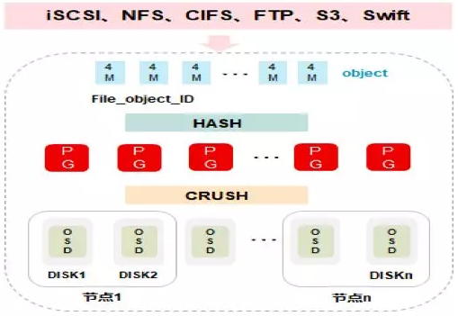

# Ceph的搭建和学习笔记

author:Damon 

参考资料：**[Ceph分布式存储工作原理 及 部署介绍](https://www.cnblogs.com/kevingrace/p/8387999.html)**

**现在市面常见的分步式存储系统（HDFS、Ceph等）**

在主流的分布式存储技术中，HDFS/GPFS/GFS属于文件存储，Swift属于对象存储，而Ceph可支持块存储、对象存储和文件存储，故称为统一存储。

### 基本概念：

对象存储：

```
使用场景： (适合更新变动较少的数据)
     图片存储。
     视频存储。 
这个挺厉害！
```


### Ceph的数据写入

 Ceph数据的写入流程
 **<1>** 数据通过负载均衡获得节点动态IP地址；
 **<2>** 通过块、文件、对象协议将文件传输到节点上；
 **<3>** 数据被分割成4M对象并取得对象ID；
 **<4>** 对象ID通过HASH算法被分配到不同的PG；
 **<5>** 不同的PG通过CRUSH算法被分配到不同的OSD



总结：

也就是说通过引入PG模块，增加数据的写入速度，其中id-->>PG 采用的是HASH算法，PG-->>节点（OSD）采用的是CRUSH算法

了解了什么是ceph之后，笔者将在Docker搭建Docker Ceph 集群的安装配置

简单部署：


## 下面是安装Ceph的过程源码，仅供大家参考。

```shell
#创建三个用户，三台虚拟机
damon1  damon2  damon3
```


| 主机名称 | 主机IP | 说明                                           |
| -------- | ------ | ---------------------------------------------- |
| damon-1  |        | 容器主节点(Dashbaord、mon、mds、rgw、mgr、osd) |
| damon-2  |        | 容器子节点(mon、mds、rgw、mgr、osd)            |
| damon-3  |        | 容器子节点(mon、mds、rgw、mgr、osd)            |


### 安装docker

```shell
#为了方便直接三台主机同时以root身份依次在三台节点上创建/usr/local/ceph/{admin,data, etc,lib, logs}目录：
[root@damon-1 ~]#  mkdir -p /usr/local/ceph/{admin,data,etc,lib,logs}
...
...
#卸载旧版本
[root@damon-1 ~]# yum -y remove docker  docker-common docker-selinux docker-engine
#安装依赖包
[root@damon-1 ~]# yum -y install yum-utils device-mapper-persistent-data lvm2
Loaded plugins: fastestmirror
Determining fastest mirrors
base                                                                      | 3.6 kB  00:00:00     
epel                                                                      | 4.7 kB  00:00:00     
extras                                                                    | 2.9 kB  00:00:00     
updates                                                                   | 2.9 kB  00:00:00     
(1/7): epel/x86_64/group_gz                                               |  96 kB  00:00:00     
(2/7): epel/x86_64/updateinfo                                             | 1.0 MB  00:00:00     
(3/7): base/7/x86_64/primary_db                                           | 6.1 MB  00:00:00     
(4/7): base/7/x86_64/group_gz                                             | 153 kB  00:00:00 
...
...
...
#配置YUM源
[root@damon-1 ~]# yum-config-manager --add-repo https://download.docker.com/linux/centos/docker-ce.repo
Loaded plugins: fastestmirror
adding repo from: https://download.docker.com/linux/centos/docker-ce.repo
grabbing file https://download.docker.com/linux/centos/docker-ce.repo to /etc/yum.repos.d/docker-ce.repo
repo saved to /etc/yum.repos.d/docker-ce.repo

#安装Docker服务
[root@damon-1 ~]# yum -y install docker-ce-18.03.1.ce
Loaded plugins: fastestmirror
Loading mirror speeds from cached hostfile
docker-ce-stable                                                      | 3.5 kB  00:00:00 
...
...
...
#启动服务
[root@damon-1 ~]# systemctl start docker

#设置开机启动
[root@damon-1 ~]# systemctl enable docker

#查看docker是否成功
[root@damon-1 ~]# docker -v
Docker version 18.03.1-ce, build 9ee9f40
[root@damon-2 ~]# docker -v
Docker version 18.03.1-ce, build 9ee9f40
[root@damon-3 ~]# docker -v
Docker version 18.03.1-ce, build 9ee9f40

```


### 安装ceph

安装完docker,开始在docker下载ceph镜像--nautilus版本

```shell
#下载镜像
[root@damon-1 ~]# docker pull ceph/daemon:master-7ef46af-nautilus-centos-7-x86_64
master-7ef46af-nautilus-centos-7-x86_64: Pulling from ceph/daemon
ab5ef0e58194: Pull complete 
5d6820ae3da1: Pull complete 
...
...
#修改标签
[root@damon-1 ~]# docker images
REPOSITORY          TAG                                       IMAGE ID            CREATED             SIZE
ceph/daemon         master-7ef46af-nautilus-centos-7-x86_64   6f68932df7dd        23 months ago       946MB
[root@damon-1 ~]# docker tag 6f68932df7dd ceph/daemon:latest
[root@damon-1 ~]# docker images
REPOSITORY          TAG                                       IMAGE ID            CREATED             SIZE
ceph/daemon         latest                                    6f68932df7dd        23 months ago       946MB
ceph/daemon         master-7ef46af-nautilus-centos-7-x86_64   6f68932df7dd        23 months ago       946MB

```

### 启动mon服务

在主节点的/usr/local/ceph/admin目录下创建start_mon.sh脚本

```shell
#damon1是该案例的主节点
[root@damon-1 ~]# cd /usr/local/ceph/admin
[root@damon-1 admin]# ls
[root@damon-1 admin]# vim start_mon.sh 
[root@damon-1 admin]# cat start_mon.sh 
docker run -d --net=host \
    --name=mon \
    -v /etc/localtime:/etc/localtime \
    -v /usr/local/ceph/etc:/etc/ceph \
    -v /usr/local/ceph/lib:/var/lib/ceph \
    -v /usr/local/ceph/logs:/var/log/ceph \
    -e MON_IP=172.26.183.115 \
    -e CEPH_PUBLIC_NETWORK=172.26.183.0/24 \
    ceph/daemon:latest mon
#IP写主机ip
[root@damon-1 admin]# chmod 777 -R  /usr/local/ceph/admin/start_mon.sh    #修改权限
[root@damon-1 admin]# bash /usr/local/ceph/admin/start_mon.sh
145bdaafb97aa42917327f3ab64f22005a81f3b39a6ac11dc5e6abd7c9a8b7e7

#创建Ceph配置文件
[root@damon-1 admin]# vi /usr/local/ceph/etc/ceph.conf
[root@damon-1 admin]# cat /usr/local/ceph/etc/ceph.conf
[global]
fsid = c29075e1-6a98-4ae1-b4c2-cfc3008a07d4
mon initial members = damon-1
mon host = 172.26.183.115
public network = 172.26.183.0/24
cluster network = 172.26.183.0/24
osd journal size = 100
osd pool default size = 2
mon clock drift allowed = 10
mon clock drift warn backoff = 30
mon_allow_pool_delete = true
[mgr]
mgr modules = dashboard
[client.rgw.CENTOS7-1]
rgw_frontends = "civetweb port=20003"


#检查mon服务状态，
#出现HEALTH_OK代表服务启动成功：
[root@damon-1 admin]#  docker exec -it mon ceph -s 
  cluster:
    id:     c29075e1-6a98-4ae1-b4c2-cfc3008a07d4
    health: HEALTH_OK
 
  services:
    mon: 1 daemons, quorum damon-1 (age 10s)
    mgr: no daemons active
    osd: 0 osds: 0 up, 0 in
    
#将主节点配置复制到其他两个节点， 覆盖/usr/local/ceph/目录。
[root@damon-1 admin]# scp -r /usr/local/ceph/ root@172.26.183.116:/usr/local/
The authenticity of host '172.26.183.116 (172.26.183.116)' can't be established.
ECDSA key fingerprint is SHA256:2CS0jrH0Hdku4cfElqfYX9GfDli83RjkRYYguwDxsaw.
ECDSA key fingerprint is MD5:c5:79:f0:95:63:3f:55:b0:e3:cb:f6:4e:45:43:6e:d1.
Are you sure you want to continue connecting (yes/no)? ^[[A^[[Byes
Please type 'yes' or 'no': yes
Warning: Permanently added '172.26.183.116' (ECDSA) to the list of known hosts.
root@172.26.183.116's password: 
kv_backend                                                           100%    8    31.5KB/s   00:00    
...
...
...


[root@damon-1 admin]# scp -r /usr/local/ceph/ root@172.26.183.114:/usr/local/
The authenticity of host '172.26.183.114 (172.26.183.114)' can't be established.
ECDSA key fingerprint is SHA256:eF6SVc5AF+UKhv+1wTGVFkIu+ZaDJe5g/Pdnxj7w/2o.
ECDSA key fingerprint is MD5:ab:8a:68:ff:eb:a4:03:75:ba:cc:a7:fe:a6:32:15:46.
Are you sure you want to continue connecting (yes/no)? yes
Warning: Permanently added '172.26.183.114' (ECDSA) to the list of known hosts.
root@172.26.183.114's password: 
kv_backend                                                                                                                                               100%    8    31.6KB/s   00:00    
min_mon_release                                                                                                                                          100%    3    14.8KB/s   00:00    
OPTIONS-000005                                                                                                                                           100% 4943    15.4MB/s   00:00    
...
...
...

#另外两台机启动mon服务
#将两台机的hostid 改为本机地址
[root@damon-3 ~]# vi /usr/local/ceph/etc/ceph.conf
[root@damon-3 ~]#  cd /usr/local/ceph/admin
[root@damon-3 admin]# ls
start_mon.sh
[root@damon-3 admin]# vim start_mon.sh 
[root@damon-3 admin]# cat start_mon.sh 
docker run -d --net=host \
    --name=mon \
    -v /etc/localtime:/etc/localtime \
    -v /usr/local/ceph/etc:/etc/ceph \
    -v /usr/local/ceph/lib:/var/lib/ceph \
    -v /usr/local/ceph/logs:/var/log/ceph \
    -e MON_IP=172.26.183.114 \
    -e CEPH_PUBLIC_NETWORK=172.26.183.0/24 \
    ceph/daemon:latest mon


[root@damon-2 local]# /usr/local/ceph/admin/start_mon.sh
d08e5414eb4ad4bc1c7838fc3c9498b979d4c4eebda21214c7eee266af71b672
[root@damon-3 ~]# /usr/local/ceph/admin/start_mon.sh
02083a88ebb0cee4c043ee67f7d8e8273b2fed47bd1f09fdb8abdfe9a55ac02f


##然后就有三个mon配置好了
[root@damon-1 admin]# docker exec -it mon ceph -s 
  cluster:
    id:     c29075e1-6a98-4ae1-b4c2-cfc3008a07d4
    health: HEALTH_OK
 
  services:
    mon: 3 daemons, quorum damon-1,damon-2,damon-3 (age 22s)
    mgr: no daemons active
    osd: 0 osds: 0 up, 0 in
 
  data:
    pools:   0 pools, 0 pgs
    objects: 0 objects, 0 B
    usage:   0 B used, 0 B / 0 B avail
    pgs:     

```

### 创建osd

```shell
[root@damon-1 admin]# mkdir  -p /usr/local/ceph-disk
[root@damon-1 admin]# dd if=/dev/zero of=/usr/local/ceph-disk/ceph-disk-01 bs=1G count=10
10+0 records in
10+0 records out
10737418240 bytes (11 GB) copied, 96.8259 s, 111 MB/s
[root@damon-1 admin]# losetup -f /usr/local/ceph-disk/ceph-disk-01
[root@damon-1 admin]# mkfs.xfs -f /dev/loop0 
meta-data=/dev/loop0             isize=512    agcount=4, agsize=655360 blks
         =                       sectsz=512   attr=2, projid32bit=1
         =                       crc=1        finobt=0, sparse=0
data     =                       bsize=4096   blocks=2621440, imaxpct=25
         =                       sunit=0      swidth=0 blks
naming   =version 2              bsize=4096   ascii-ci=0 ftype=1
log      =internal log           bsize=4096   blocks=2560, version=2
         =                       sectsz=512   sunit=0 blks, lazy-count=1
realtime =none                   extsz=4096   blocks=0, rtextents=0
[root@damon-1 admin]# mkdir  -p /usr/local/ceph/data/osd/
[root@damon-1 admin]# mount /dev/loop0  /usr/local/ceph/data/osd/
[root@damon-1 admin]# vi /usr/local/ceph/admin/start_osd.sh
[root@damon-1 admin]# cat /usr/local/ceph/admin/start_osd.sh
[root@damon-1 admin]# cat /usr/local/ceph/admin/start_osd.sh
docker run -d \
    --name=osd \
    --net=host \
    --privileged=true \
    --pid=host \
    -v /etc/localtime:/etc/localtime \
    -v /usr/local/ceph/etc:/etc/ceph \
    -v /usr/local/ceph/lib:/var/lib/ceph \
    -v /usr/local/ceph/logs:/var/log/ceph \
    -v /usr/local/ceph/data/osd:/var/lib/ceph/osd \
    ceph/daemon:latest osd_directory
[root@damon-2 admin]# chmod 777 /usr/local/ceph/admin/start_osd.sh
[root@damon-2 admin]# docker exec -it mon ceph auth get client.bootstrap-osd -o /var/lib/ceph/bootstrap-osd/ceph.keyring
exported keyring for client.bootstrap-osd
[root@damon-2 admin]# bash /usr/local/ceph/admin/start_osd.sh
6b5eca79ea1e802c49de47983713b1444696d0b107e402d16b3819c6f1da6327
[root@damon-2 admin]# docker ps -a | grep osd
6b5eca79ea1e        ceph/daemon:latest   "/opt/ceph-container…"   4 seconds ago       Up 3 seconds                            osd


##然后osd就弄好了！！
[root@damon-2 admin]# docker exec -it mon ceph -s 
  cluster:
    id:     c29075e1-6a98-4ae1-b4c2-cfc3008a07d4
    health: HEALTH_WARN
            no active mgr
 
  services:
    mon: 3 daemons, quorum damon-1,damon-2,damon-3 (age 26m)
    mgr: no daemons active
    osd: 3 osds: 3 up (since 21s), 3 in (since 21s)
 
  data:
    pools:   0 pools, 0 pgs
    objects: 0 objects, 0 B
    usage:   0 B used, 0 B / 0 B avail
    pgs:     

```

### mgr服务

```shell
[root@damon-2 admin]# vi /usr/local/ceph/admin/start_mgr.sh
[root@damon-2 admin]# cat /usr/local/ceph/admin/start_mgr.sh
docker run \
-d --net=host  \
--name=mgr \
-v /etc/localtime:/etc/localtime \
-v /usr/local/ceph/etc:/etc/ceph \
-v /usr/local/ceph/lib:/var/lib/ceph \
-v /usr/local/ceph/logs:/var/log/ceph \
ceph/daemon mgr
[root@damon-2 admin]# bash /usr/local/ceph/admin/start_mgr.sh
2e2c16cb786d2d60ff6912d9c5b31b0fef4310dbcefed70e57f56f3970a27b12
[root@damon-2 admin]# docker ps -a | grep mgr
2e2c16cb786d        ceph/daemon          "/opt/ceph-container…"   10 seconds ago      Up 10 seconds                           mgr
##mgr也安装好了
[root@damon-2 admin]# docker exec -it mon ceph -s 
  cluster:
    id:     c29075e1-6a98-4ae1-b4c2-cfc3008a07d4
    health: HEALTH_OK
 
  services:
    mon: 3 daemons, quorum damon-1,damon-2,damon-3 (age 30m)
    mgr: damon-2(active, since 14s), standbys: damon-1, damon-3
    osd: 3 osds: 3 up (since 4m), 3 in (since 4m)
 
  data:
    pools:   0 pools, 0 pgs
    objects: 0 objects, 0 B
    usage:   3.0 GiB used, 27 GiB / 30 GiB avail
    pgs:     
 

```


### rgw服务

```shell
[root@damon-2 admin]# vi /usr/local/ceph/admin/start_rgw.sh
[root@damon-2 admin]# cat /usr/local/ceph/admin/start_rgw.sh
docker run \
-d --net=host \
--name=rgw \
-v /etc/localtime:/etc/localtime \
-v /usr/local/ceph/etc:/etc/ceph \
-v /usr/local/ceph/lib:/var/lib/ceph \
-v /usr/local/ceph/logs:/var/log/ceph \
ceph/daemon rgw
[root@damon-2 admin]# docker exec mon ceph auth get client.bootstrap-rgw -o /var/lib/ceph/bootstrap-rgw/ceph.keyring
exported keyring for client.bootstrap-rgw
[root@damon-2 admin]# bash /usr/local/ceph/admin/start_mgr.sh
docker: Error response from daemon: Conflict. The container name "/mgr" is already in use by container "2e2c16cb786d2d60ff6912d9c5b31b0fef4310dbcefed70e57f56f3970a27b12". You have to remove (or rename) that container to be able to reuse that name.
See 'docker run --help'.
[root@damon-2 admin]# bash /usr/local/ceph/admin/start_rgw.sh
60dd308301fb60b84017eddecb62dceeb5e489df85c3a28ccfdcc6b5dba2e0f2
[root@damon-2 admin]#  docker ps -a | grep rgw
60dd308301fb        ceph/daemon          "/opt/ceph-container…"   16 seconds ago      Up 15 seconds                           rgw
[root@damon-2 admin]# docker exec -it mon ceph -s 
  cluster:
    id:     c29075e1-6a98-4ae1-b4c2-cfc3008a07d4
    health: HEALTH_WARN
            too few PGs per OSD (21 < min 30)
 
  services:
    mon: 3 daemons, quorum damon-1,damon-2,damon-3 (age 34m)
    mgr: damon-2(active, since 4m), standbys: damon-1, damon-3
    osd: 3 osds: 3 up (since 8m), 3 in (since 8m)
    rgw: 3 daemons active (damon-1, damon-2, damon-3)
 
  data:
    pools:   4 pools, 32 pgs
    objects: 90 objects, 3.1 KiB
    usage:   3.0 GiB used, 27 GiB / 30 GiB avail
    pgs:     32 active+clean
 
  io:
    client:   39 KiB/s rd, 0 B/s wr, 48 op/s rd, 32 op/s wr


```

### 启动mds服务

```shell
[root@damon-2 admin]# vi /usr/local/ceph/admin/start_mds.sh
[root@damon-2 admin]# cat /usr/local/ceph/admin/start_mds.sh
docker run -d \
   --net=host \
   --name=mds \
   --privileged=true \
   -v /etc/localtime:/etc/localtime \
   -v /usr/local/ceph/etc:/etc/ceph \
   -v /usr/local/ceph/lib:/var/lib/ceph \
   -v /usr/local/ceph/logs:/var/log/ceph \
   -e CEPHFS_CREATE=0 \
   -e CEPHFS_METADATA_POOL_PG=512 \
   -e CEPHFS_DATA_POOL_PG=512 \
   ceph/daemon mds
[root@damon-2 admin]# bash /usr/local/ceph/admin/start_mds.sh
0d599833e68b0ff728943ae3c545647580ac5c9df13dfb6e9ead060ccaf20530
[root@damon-2 admin]#  docker ps -a | grep mds
0d599833e68b        ceph/daemon          "/opt/ceph-container…"   9 seconds ago       Up 9 seconds                            mds
[root@damon-2 admin]# docker exec -it mon ceph -s 
  cluster:
    id:     c29075e1-6a98-4ae1-b4c2-cfc3008a07d4
    health: HEALTH_WARN
            too few PGs per OSD (21 < min 30)
 
  services:
    mon: 3 daemons, quorum damon-1,damon-2,damon-3 (age 37m)
    mgr: damon-2(active, since 7m), standbys: damon-1, damon-3
    osd: 3 osds: 3 up (since 11m), 3 in (since 11m)
    rgw: 3 daemons active (damon-1, damon-2, damon-3)
 
  data:
    pools:   4 pools, 32 pgs
    objects: 190 objects, 3.1 KiB
    usage:   3.0 GiB used, 27 GiB / 30 GiB avail
    pgs:     32 active+clean
 


```


### 创建fs文件系统

```shell
[root@damon-1 admin]# docker exec osd ceph osd pool create cephfs_data 128 128
pool 'cephfs_data' created
[root@damon-1 admin]# docker exec osd ceph osd pool create cephfs_metadata 64 64
pool 'cephfs_metadata' created
[root@damon-1 admin]# docker exec osd ceph fs new cephfs cephfs_metadata cephfs_data
new fs with metadata pool 6 and data pool 5
[root@damon-1 admin]# docker exec osd ceph fs ls
name: cephfs, metadata pool: cephfs_metadata, data pools: [cephfs_data ]
[root@damon-1 admin]#  docker exec mon ceph -s
  cluster:
    id:     c29075e1-6a98-4ae1-b4c2-cfc3008a07d4
    health: HEALTH_OK
 
  services:
    mon: 3 daemons, quorum damon-1,damon-2,damon-3 (age 63m)
    mgr: damon-2(active, since 25m), standbys: damon-1, damon-3
    mds: cephfs:1 {0=damon-1=up:active} 2 up:standby
    osd: 3 osds: 3 up (since 37m), 3 in (since 37m)
    rgw: 3 daemons active (damon-1, damon-2, damon-3)
 
  data:
    pools:   6 pools, 224 pgs
    objects: 212 objects, 5.4 KiB
    usage:   3.0 GiB used, 27 GiB / 30 GiB avail
    pgs:     224 active+clean

```

