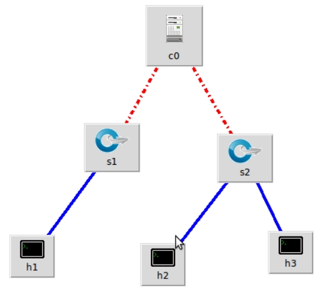
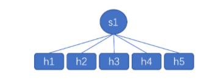
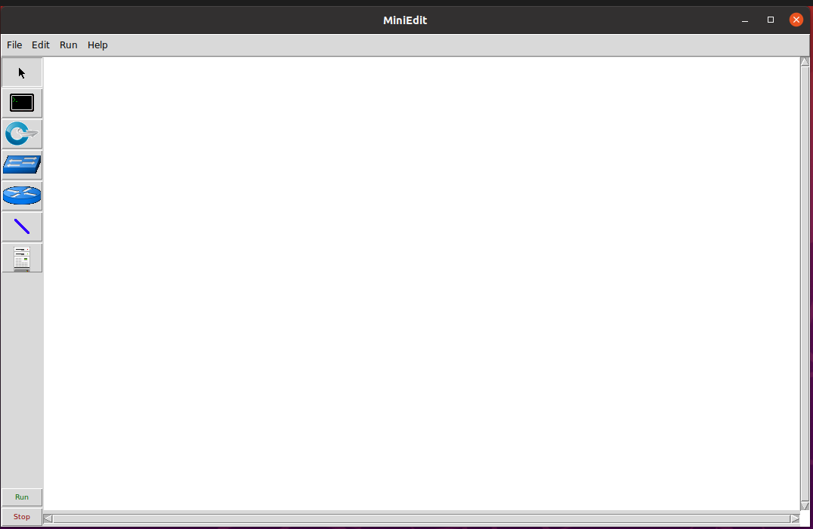
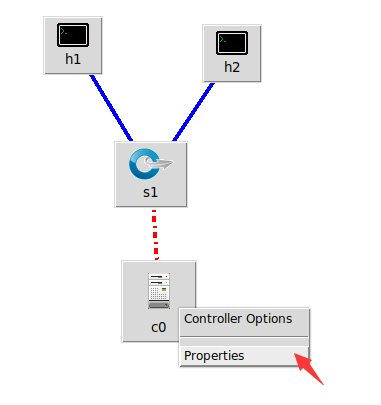
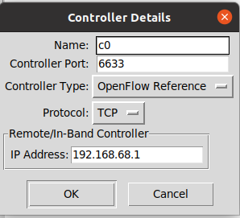
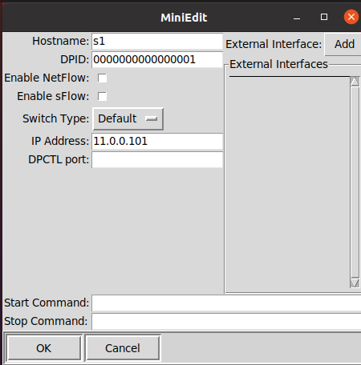
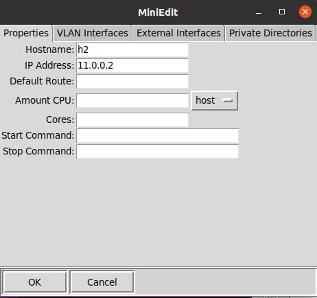
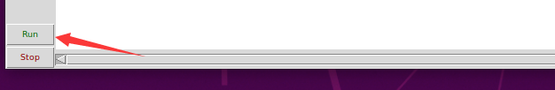
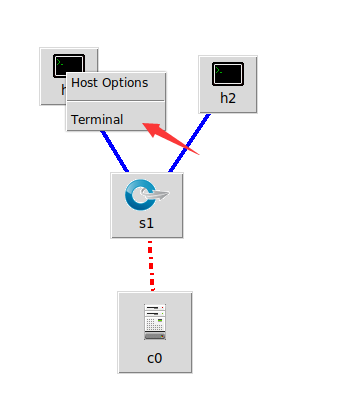

# Mininet的搭建和学习笔记

author:Damon

参考资料：**Mininet**安裝教學

### 什么是Mininet

 Mininet是由一些虚拟的终端节点（end-hosts）、交换机、路由器连接而成的一个**网络仿真器**，它采用轻量级的虚拟化技术使得系统可以和真实网络相媲美。

什么是SDN,openflow

SDN（Software Defined Network）即软件定义网络，是一种网络设计理念，或者一种推倒重来的设计思想。只要网络硬件可以集中式软件管理，可编程化，控制转发层面分开，则可以认为这个网络是一个SDN网络。所以说，SDN并不是一个具体的技术，不是一个具体的协议，而是一个思想、一个框架。狭义的SDN是指的“软件定义网络”，广义的SDN的概念还延伸出了：软件定义安全、软件定义存储等等。可以说，SDN是一个浪潮，席卷整个IT产业。

*OpenFlow*，一种网络通信协议，属于数据链路层，能够控制网上交换器或路由器的转发平面（forwarding plane），借此改变网络数据包所走的网络路径。

### 基本概念

SDN Controller 控制器(c0)，

交换机 (s1和s2)，

主机 (h1和h2和h3)。



安装源码：

```shell
#基础环境————ubuntu 20.04.1
#安装git
damonpkl@damonpkl-VirtualBox:~$ sudo apt install git
[sudo] password for damonpkl: 
Reading package lists... Done
Building dependency tree       
Reading state information... Done
The following additional pa
...
#安装mininet
damonpkl@damonpkl-VirtualBox:~$ git clone git://github.com/mininet/mininet.git 
Cloning into 'mininet'...
remote: Enumerating objects: 10182, done.
remote: Counting objects: 100% (28/28), done.
remote: Compressing objects: 100% (21/21), done.
remote: Total 10182 (delta 9), reused 16 (delta 6), pack-reused 10154
Receiving objects: 100% (10182/10182), 3.22 MiB | 2.42 MiB/s, done.
Resolving deltas: 100% (6791/6791), done.
#查看该文件的路径，目标进入到/mininet/util找到install.sh
damonpkl@damonpkl-VirtualBox:~$ cd mininet
damonpkl@damonpkl-VirtualBox:~/mininet$ ls 
bin           custom  doc       INSTALL  Makefile  mnexec.c   setup.py
CONTRIBUTORS  debian  examples  LICENSE  mininet   README.md  util
damonpkl@damonpkl-VirtualBox:~/mininet$ cd util
damonpkl@damonpkl-VirtualBox:~/mininet/util$ ls
build-ovs-packages.sh  install.sh   openflow-patches  versioncheck.py
clustersetup.sh        kbuild       sch_htb-ofbuf     vm
colorfilters           m            sysctl_addon
doxify.py              nox-patches  unpep8
damonpkl@damonpkl-VirtualBox:~/mininet/util$ sudo  ./install.sh

...
make[2]: Nothing to be done for 'install-data-am'.
make[2]: Leaving directory '/home/damonpkl/oflops/cbench'
make[1]: Leaving directory '/home/damonpkl/oflops/cbench'
Making install in doc
make[1]: Entering directory '/home/damonpkl/oflops/doc'
make[1]: Nothing to be done for 'install'.
make[1]: Leaving directory '/home/damonpkl/oflops/doc'
Enjoy Mininet!

damonpkl@damonpkl-VirtualBox:~/mininet/util$ sudo ./install.sh -a^C
damonpkl@damonpkl-VirtualBox:~/mininet/util$ sudo mn
[sudo] password for damonpkl: 
*** Creating network
*** Adding controller
*** Adding hosts:
h1 h2 
*** Adding switches:
s1 
*** Adding links:
(h1, s1) (h2, s1) 
*** Configuring hosts
h1 h2 
*** Starting controller
c0 
*** Starting 1 switches
s1 ...
*** Starting CLI:
mininet> 

#安装成功
```

基本命令

|   命令   |               功能                |   命令    |               功能                |
| :------: | :-------------------------------: | :-------: | :-------------------------------: |
|   help   |           打印帮助信息            |   nodes   |         查看全部节点信息          |
|  xterm   |           打开xterm窗口           |    net    |         查看网络拓扑信息          |
|   ping   |      h1 ping h2 ，测试连通性      |   dump    |           输出节点信息            |
|  iperf   |         指定节点间TCP测试         | iperdudp  | 指定节点间UDP测试，可指定发送速率 |
|    py    |          运行python语句           |    sh     |           执行shell脚本           |
| host cmd | 在主机中执行命令，例：h1 ifconfig | exit/quit |            退出Mininet            |

### 简单实战mininet

```shell
damonpkl@damonpkl-VirtualBox:~$ sudo mn
*** Creating network
*** Adding controller
*** Adding hosts:
h1 h2 
*** Adding switches:
s1 
*** Adding links:
(h1, s1) (h2, s1) 
*** Configuring hosts
h1 h2 
*** Starting controller
c0 
*** Starting 1 switches
s1 ...
*** Starting CLI:
#也就是说建立了两个主机（h1,h2）在同一个交换机(s1)下
mininet> net
h1 h1-eth0:s1-eth1
h2 h2-eth0:s1-eth2
s1 lo:  s1-eth1:h1-eth0 s1-eth2:h2-eth0
c0
#第一种结构，主要看net
damonpkl@damonpkl-VirtualBox:~$ sudo mn --topo=tree,2,3
\*** Creating network
*** Adding controller
*** Adding hosts:
h1 h2 h3 h4 h5 h6 h7 h8 h9 
*** Adding switches:
s1 s2 s3 s4 
*** Adding links:
(s1, s2) (s1, s3) (s1, s4) (s2, h1) (s2, h2) (s2, h3) (s3, h4) (s3, h5) (s3, h6) (s4, h7) (s4, h8) (s4, h9) 
*** Configuring hosts
h1 h2 h3 h4 h5 h6 h7 h8 h9 
*** Starting controller
c0 
*** Starting 4 switches
s1 s2 s3 s4 ...
*** Starting CLI:
mininet> net
h1 h1-eth0:s2-eth1
h2 h2-eth0:s2-eth2
h3 h3-eth0:s2-eth3
h4 h4-eth0:s3-eth1
h5 h5-eth0:s3-eth2
h6 h6-eth0:s3-eth3
h7 h7-eth0:s4-eth1
h8 h8-eth0:s4-eth2
h9 h9-eth0:s4-eth3
s1 lo:  s1-eth1:s2-eth4 s1-eth2:s3-eth4 s1-eth3:s4-eth4
s2 lo:  s2-eth1:h1-eth0 s2-eth2:h2-eth0 s2-eth3:h3-eth0 s2-eth4:s1-eth1
s3 lo:  s3-eth1:h4-eth0 s3-eth2:h5-eth0 s3-eth3:h6-eth0 s3-eth4:s1-eth2
s4 lo:  s4-eth1:h7-eth0 s4-eth2:h8-eth0 s4-eth3:h9-eth0 s4-eth4:s1-eth3
c0
#结构如下图所示


```


```shell
#第二种结构,看net
damonpkl@damonpkl-VirtualBox:~$ sudo mn --topo=single,5
*** Creating network
*** Adding controller
*** Adding hosts:
h1 h2 h3 h4 h5 
*** Adding switches:
s1 
*** Adding links:
(h1, s1) (h2, s1) (h3, s1) (h4, s1) (h5, s1) 
*** Configuring hosts
h1 h2 h3 h4 h5 
*** Starting controller
c0 
*** Starting 1 switches
s1 ...
*** Starting CLI:
mininet> net
h1 h1-eth0:s1-eth1
h2 h2-eth0:s1-eth2
h3 h3-eth0:s1-eth3
h4 h4-eth0:s1-eth4
h5 h5-eth0:s1-eth5
s1 lo:  s1-eth1:h1-eth0 s1-eth2:h2-eth0 s1-eth3:h3-eth0 s1-eth4:h4-eth0 s1-eth5:h5-eth0
c0
#结构如下图所示
```



```shell
#可视化操作
##检查python安装环境
damonpkl@damonpkl-VirtualBox:~/Desktop$ python3 --version
Python 3.8.10
damonpkl@damonpkl-VirtualBox:~/Desktop$ whereis python3
python3: /usr/bin/python3.8 /usr/bin/python3 /usr/bin/python3.8-config /usr/lib/python3.9 /usr/lib/python3.8 /usr/lib/python3 /etc/python3.8 /etc/python3 /usr/local/lib/python3.8 /usr/include/python3.8 /usr/share/python3 /usr/share/man/man1/python3.1.gz
damonpkl@damonpkl-VirtualBox:~/Desktop$ sudo ln -s /usr/bin/python3 /usr/bin/python
[sudo] password for damonpkl: 
damonpkl@damonpkl-VirtualBox:~$ cd mininet
damonpkl@damonpkl-VirtualBox:~/mininet$ ls
bin           debian    INSTALL   mininet  mnexec.1   setup.py
CONTRIBUTORS  doc       LICENSE   mn.1     mnexec.c   util
custom        examples  Makefile  mnexec   README.md
damonpkl@damonpkl-VirtualBox:~/mininet$ cd examples/
damonpkl@damonpkl-VirtualBox:~/mininet/examples$ ls
baresshd.py       controlnet.py       mobility.py       README.md
bind.py           cpu.py              multilink.py      scratchnet.py
clustercli.py     emptynet.py         multiping.py      scratchnetuser.py
clusterdemo.py    hwintf.py           multipoll.py      simpleperf.py
clusterperf.py    __init__.py         multitest.py      sshd.py
cluster.py        intfoptions.py      natnet.py         test
clusterSanity.py  limit.py            nat.py            tree1024.py
consoles.py       linearbandwidth.py  numberedports.py  treeping64.py
controllers2.py   linuxrouter.py      popenpoll.py      vlanhost.py
controllers.py    miniedit.py         popen.py
damonpkl@damonpkl-VirtualBox:~/mininet/examples$ sudo ./miniedit.py 

#打开界面如下
可以看出左侧的工具栏中的工具，第一个简体，第二个代表主机，第三个代表sdn交换机，第四个代表普通交换机，第五个代表路由器，第六个是线路，第七个代表控制器。
```



修改参数，让两台主机相连
















```shell
#尝试h1能否和h2ping通
ping 11.0.0.2 -c 3
```


