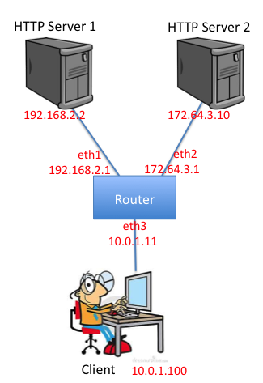

## Introduction

In this lab assignment you will be writing a simple router with a static routing table. Your router will receive raw Ethernet frames. It will process the packets just like a real router, then forward them to the correct outgoing interface. We’ll make sure you receive the Ethernet frames; your job is to create the forwarding logic so packets go to the correct interface.

Your router will route real packets from a emulated host (client) to two emulated application servers (http server 1/2) sitting behind your router. The application servers are each running an HTTP server. When you have finished the forwarding path of your router, you should be able to access these servers using regular client software. In addition, you should be able to ping and traceroute to and through a functioning Internet router. A sample routing topology is shown below:



If the router is functioning correctly, all of the following operations should work:

* Pinging from the client to any of the router's interfaces (192.168.2.1, 172.64.3.1, 10.0.1.1). 
* Tracerouting from the client to any of the router's interfaces
* Pinging from the client to any of the app servers (192.168.2.2, 172.64.3.10)
* Tracerouting from the client to any of the app servers
* Downloading a file using HTTP from one of the app servers

Additional requirements are laid out in the 'Requirements' section.

## Mininet
This assignment runs on top of Mininet. Mininet allows you to emulate a topology on a single machine. It provides the needed isolation between the emulated nodes so that your router node can process and forward real Ethernet frames between the hosts like a real router. You don't have to know how Mininet works to complete this assignment, but more information about Mininet (if you're curious) is available [here](http://mininet.org). 

## Get Started
### Environment Setup
Please refer to [[Environment Setup]] for setting up the environment.

### Check Out Starter Code
```no-highlight
cd ~
git clone https://huangty@bitbucket.org/huangty/cs144_lab3.git
cd cs144_lab3/
git checkout --track remotes/origin/standalone
```

### Install Simple Router POX module
```no-highlight
cd ~/cs144_lab3
./config.sh
```

### Configuration Files
There are two configuration files. 
* `~/cs144_lab3/IP_CONFIG`: Listed out the IP addresses assigned to the emulated hosts. 
* `~/cs144_lab3/router/rtable` (also linked to `~/cs144_lab3/rtable`): The static routing table used for the simple router. 

The default `IP_CONFIG` and `rtable` should look like the following:

```no-highlight
> cat ~/cs144_lab3/IP_CONFIG
server1 192.168.2.2
server2 172.64.3.10
client    10.0.1.100
sw0-eth1 192.168.2.1
sw0-eth2 172.64.3.1
sw0-eth3 10.0.1.1
```
```no-highlight
> cat ~/cs144_lab3/rtable
10.0.1.100  10.0.1.100  255.255.255.255 eth3
192.168.2.2 192.168.2.2 255.255.255.255 eth1
172.64.3.10  172.64.3.10  255.255.255.255 eth2
```

### Test Connectivity of Your Emulated Topology
#### Configure the environment by running the config.sh file
```no-highlight
> cd ~/cs144_lab3/
> ./config.sh
```
#### Start Mininet emulation by using the following command
```no-highlight
> cd ~/cs144_lab3/
> ./run_mininet.sh
```
You should be able to see some output like the following: 

```
*** Shutting down stale SimpleHTTPServers  
*** Shutting down stale webservers  
server1 192.168.2.2
server2 172.64.3.10
client 10.0.1.100
sw0-eth1 192.168.2.1
sw0-eth2 172.64.3.1
sw0-eth3 10.0.1.1
*** Successfully loaded ip settings for hosts
 {'server1': '192.168.2.2', 'sw0-eth3': '10.0.1.1', 'sw0-eth1': '192.168.2.1', 'sw0-eth2': '172.64.3.1', 'client': '10.0.1.100', 'server2': '172.64.3.10'}
*** Creating network
*** Creating network
*** Adding controller
*** Adding hosts:
client server1 server2 
*** Adding switches:
sw0 
*** Adding links:
(client, sw0) (server1, sw0) (server2, sw0) 
*** Configuring hosts
client server1 server2 
*** Starting controller
*** Starting 1 switches
sw0 
*** setting default gateway of host server1
server1 192.168.2.1
*** setting default gateway of host server2
server2 172.64.3.1
*** setting default gateway of host client
client 10.0.1.1
*** Starting SimpleHTTPServer on host server1 
*** Starting SimpleHTTPServer on host server2 
*** Starting CLI:
mininet> 
```
Keep this terminal open, as you will need the mininet command line for debugging. Now, use another terminal to continue the next step. (Do not press ctrl-z.) 

Mininet requires a controller, which we implemented in POX (revision `f95dd1a81584d716823bbf565fa68254416af603`). To run the controller, use the following command:

```no-highlight
> cd ~/cs144_lab3/
> ln -s ../pox
> ./run_pox.sh
```
You should be able to see some output like the following:

```
POX 0.0.0 / Copyright 2011 James McCauley
DEBUG:.home.ubuntu.cs144_lab3.pox_module.cs144.ofhandler:*** ofhandler: Successfully loaded ip settings for hosts
 {'server1': '192.168.2.2', 'sw0-eth3': '10.0.1.1', 'sw0-eth1': '192.168.2.1', 'sw0-eth2': '172.64.3.1', 'client': '10.0.1.100', 'server2': '172.64.3.10'}

INFO:.home.ubuntu.cs144_lab3.pox_module.cs144.srhandler:created server
DEBUG:.home.ubuntu.cs144_lab3.pox_module.cs144.srhandler:SRServerListener listening on 8888
DEBUG:core:POX 0.0.0 going up...
DEBUG:core:Running on CPython (2.7.3/Aug 1 2012 05:14:39)
INFO:core:POX 0.0.0 is up.
This program comes with ABSOLUTELY NO WARRANTY.  This program is free software,
and you are welcome to redistribute it under certain conditions.
Type 'help(pox.license)' for details.
DEBUG:openflow.of_01:Listening for connections on 0.0.0.0:6633
Ready.
POX> 
```
**Please note that you have to wait for Mininet to connect to the POX controller before you continue to the next step**. Once Mininet has connected, you will see the following output:

```
INFO:openflow.of_01:[Con 1/249473472573510] Connected to e2-e5-11-b6-b0-46
DEBUG:.home.ubuntu.cs144_lab3.pox_module.cs144.ofhandler:Connection [Con 1/249473472573510]
DEBUG:.home.ubuntu.cs144_lab3.pox_module.cs144.srhandler:SRServerListener catch RouterInfo even, info={'eth3': ('10.0.1.1', '86:05:70:7e:eb:56', '10Gbps', 3), 'eth2': ('172.64.3.1', 'b2:9e:54:d8:9d:cd', '10Gbps', 2), 'eth1': ('192.168.2.1', '36:61:7c:4f:b6:7b', '10Gbps', 1)}, rtable=[]
```
Keep POX running. Now, open yet another terminal to continue the next step.  (Don't press ctrl-z.)

Now you are ready to test out the connectivity of the environment setup. To do so, run the binary file of the solution, `sr_solution`:

```no-highlight
> cd ~/cs144_lab3/
> ./sr_solution
```
You should be able to see some output like the following:

```
Loading routing table from server, clear local routing table.
Loading routing table
---------------------------------------------
Destination     Gateway         Mask    Iface
10.0.1.100              10.0.1.100      255.255.255.255 eth3
192.168.2.2             192.168.2.2     255.255.255.255 eth1
172.64.3.10             172.64.3.10     255.255.255.255 eth2
---------------------------------------------
Client ubuntu connecting to Server localhost:8888
Requesting topology 0
successfully authenticated as ubuntu
Loading routing table from server, clear local routing table.
Loading routing table
---------------------------------------------
Destination     Gateway         Mask    Iface
10.0.1.100              10.0.1.100      255.255.255.255 eth3
192.168.2.2             192.168.2.2     255.255.255.255 eth1
172.64.3.10             172.64.3.10     255.255.255.255 eth2
---------------------------------------------
Router interfaces:
eth3    HWaddr86:05:70:7e:eb:56
        inet addr 10.0.1.1
eth2    HWaddrb2:9e:54:d8:9d:cd
        inet addr 172.64.3.1
eth1    HWaddr36:61:7c:4f:b6:7b
        inet addr 192.168.2.1
 <-- Ready to process packets --> 
```

NOTE: If you don't see the `Router interfaces:` part and on the POX controller terminal you get:

```
DEBUG:.home.mininet.cs144_lab3.pox_module.cs144.srhandler:interfaces not populated yet
```

Then you need to exit mininet (with `Ctrl + D`), exit the `sr_solution` (with `Ctrl + C`) and then start them again (without exiting the POX controller). 

In this particular setup, 192.168.2.2 is the IP for `server1`, and 172.64.3.10 is the IP for `server2`.  You can find the IP addresses in your `IP_CONFIG` file.

Now, back to the terminal where Mininet is running. To issue a command on the emulated host, type the host name followed by the command in the Mininet console. For example, the following command issues 3 pings from the `client` to `server1`.

```no-highlight
mininet> client ping -c 3 192.168.2.2
```
You should be able to see the following output. 
```
PING 192.168.2.2 (192.168.2.2) 56(84) bytes of data.
64 bytes from 192.168.2.2: icmp_req=1 ttl=63 time=66.9 ms
64 bytes from 192.168.2.2: icmp_req=2 ttl=63 time=49.9 ms
64 bytes from 192.168.2.2: icmp_req=3 ttl=63 time=68.8 ms
```

You can also use traceroute to see the route between client to server1.
```no-highlight
mininet> client traceroute -n 192.168.2.2
```
You should be able to see the following output. 
```
traceroute to 192.168.2.2 (192.168.2.2), 30 hops max, 60 byte packets
 1  10.0.1.1  146.069 ms  143.739 ms  143.523 ms
 2  192.168.2.2  226.260 ms  226.070 ms  225.868 ms
```

Finally, to test the web server is properly working at the server1 and server2, issue an HTTP request by using _wget_ or _curl_.
```no-highlight
mininet> client wget http://192.168.2.2
```
You should be able to see the following output. 
```
--2012-12-17 06:52:23--  http://192.168.2.2/
Connecting to 192.168.2.2:80... connected.
HTTP request sent, awaiting response... 200 OK
Length: 161 [text/html]
Saving to: `index.html'

     0K                                                       100% 17.2M=0s

2012-12-17 06:52:24 (17.2 MB/s) - `index.html' saved [161/161]
```
If you stop the “./sr_solution”, you will find the ping/traceroute/wget won’t work anymore. In this assignment, you will replicate the functionality of sr_solution. To help you get started, we provide some starter code described in the following section..

## Starter Code 
You should now have all the pieces needed to build and run the router:

A routing table file that corresponds to the routing table for the router node in that topology, which we'll call _rtable_.

### The starter source code
You can build and run the starter code as follows:
```no-highlight
> cd ~/cs144_lab3/router/
> make
>./sr 
```

### Logging Packets
You can log the packets receives and generated by your SR program by using the "-l" parameter with your SR program. The file will be in pcap format, i.e., you can use wireshark or tcpdump to read it. 

```no-highlight
> ./sr -l logname.pcap
```

Besides SR, you can also use mininet to monitor the traffic goes in and out of the emulated nodes, i.e., router, server1 and server2. 
Mininet provides direct access to each emulated node. Take server1 as an example, to see the packets in and out of it, go to mininet CLI: 

```no-highlight
mininet> server1 sudo tcpdump -n -i server1-eth0
```

or you can bring up a terminal inside server1 by

```no-highlight
mininet> xterm server1
```

then inside the newly popped xterm,

```no-highlight
> sudo tcpdump -n -i server1-eth0
```

## General Forwarding Logic
To get you started, an outline of the forwarding logic for a router follows, although it does not contain all the details. There are two main parts to this assignment: [Handling ARP](#wiki-address-resolution-protocol) and [IP forwarding](#wiki-ip-forwarding)

### IP Forwarding

Given a raw Ethernet frame, if the frame contains an IP packet that is not destined for one of our interfaces:

* Sanity-check the packet (meets minimum length and has correct checksum).
* Decrement the TTL by 1, and recompute the packet checksum over the modified header.
* Find out which entry in the routing table has the longest prefix match with the destination IP address.
* Check the ARP cache for the next-hop MAC address corresponding to the next-hop IP. If it's there, send it. Otherwise, send an ARP request for the next-hop IP (if one hasn't been sent within the last second), and add the packet to the queue of packets waiting on this ARP request.

Obviously, this is a very simplified version of the forwarding process, and the low-level details follow. For example, if an error occurs in any of the above steps, you will have to send an ICMP message back to the sender notifying them of an error. You may also get an ARP request or reply, which has to interact with the ARP cache correctly.

## Protocols to Understand

### Ethernet 
You are given a raw Ethernet frame and have to send raw Ethernet frames. You should understand source and destination MAC addresses and the idea that we forward a packet one hop by changing the destination MAC address of the forwarded packet to the MAC address of the next hop's incoming interface.

### Internet Protocol
Before operating on an IP packet, you should verify its checksum and make sure it meets the minimum length of an IP packet. You should understand how to find the longest prefix match of a destination IP address in the routing table described in the "Getting Started" section. If you determine that a datagram should be forwarded, you should correctly decrement the TTL field of the header and recompute the checksum over the changed header before forwarding it to the next hop.

### Internet Control Message Protocol
ICMP is a simple protocol that can send control information to a host. In this assignment, your router will use ICMP to send messages back to a sending host. You will need to properly generate the following ICMP messages (including the ICMP header checksum) in response to the sending host under the following conditions:

* Echo reply (type 0)
Sent in response to an echo request (ping) to one of the router's interfaces. (This is only for echo requests to any of the router's IPs. An echo request sent elsewhere should be forwarded to the next hop address as usual.)
* Destination net unreachable (type 3, code 0)
** Sent if there is a non-existent route to the destination IP (no matching entry in routing table when forwarding an IP packet).
* Destination host unreachable (type 3, code 1)
** Sent if five ARP requests were sent to the next-hop IP without a response.
* Port unreachable (type 3, code 3)
** Sent if an IP packet containing a UDP or TCP payload is sent to one of the router's interfaces. This is needed for traceroute to work.
* Time exceeded (type 11, code 0)
** Sent if an IP packet is discarded during processing because the TTL field is 0. This is also needed for traceroute to work.
The source address of an ICMP message can be the source address of any of the incoming interfaces, as specified in RFC 792.
As mentioned above, the only incoming ICMP message destined towards the router's IPs that you have to explicitly process are ICMP echo requests.
You may want to create additional structs for ICMP messages for convenience, but make sure to use the packed attribute so that the compiler doesn't try to align the fields in the struct to word boundaries:

<a id=ARP></id>
### Address Resolution Protocol

ARP is needed to determine the next-hop MAC address that corresponds to the next-hop IP address stored in the routing table. Without the ability to generate an ARP request and process ARP replies, your router would not be able to fill out the destination MAC address field of the raw Ethernet frame you are sending over the outgoing interface. Analogously, without the ability to process ARP requests and generate ARP replies, no other router could send your router Ethernet frames. Therefore, your router must generate and process ARP requests and replies.

To lessen the number of ARP requests sent out, you are required to cache ARP replies. Cache entries should time out after 15 seconds to minimize staleness. The provided ARP cache class already times the entries out for you.
When forwarding a packet to a next-hop IP address, the router should first check the ARP cache for the corresponding MAC address before sending an ARP request. In the case of a cache miss, an ARP request should be sent to a target IP address about once every second until a reply comes in. If the ARP request is sent five times with no reply, an ICMP destination host unreachable is sent back to the source IP as stated above. The provided ARP request queue will help you manage the request queue.

In the case of an ARP request, you should only send an ARP reply if the target IP address is one of your router's IP addresses. In the case of an ARP reply, you should only cache the entry if the target IP address is one of your router's IP addresses.

Note that ARP requests are sent to the broadcast MAC address (`ff-ff-ff-ff-ff-ff`). ARP replies are sent directly to the requester's MAC address.

## IP Packet Destinations

An incoming IP packet may be destined for one of your router's IP addresses, or it may be destined elsewhere. If it is sent to one of your router's IP addresses, you should take the following actions, consistent with the section on protocols above:

* If the packet is an ICMP echo request and its checksum is valid, send an ICMP echo reply to the sending host.
* If the packet contains a TCP or UDP payload, send an ICMP port unreachable to the sending host.
Otherwise, ignore the packet.
Packets destined elsewhere should be forwarded using your normal forwarding logic.


## Code Overview
### Basic Functions

Your router receives a raw Ethernet frame and sends raw Ethernet frames when sending a reply to the sending host or forwarding the frame to the next hop. The basic functions to handle these functions are:
```no-highlight
void sr_handlepacket(struct sr_instance* sr, uint8_t * packet, unsigned int len, char* interface)
```
This method, located in `sr_router.c`, is called by the router each time a packet is received. The "packet" argument points to the packet buffer which contains the full packet including the ethernet header. The name of the receiving interface is passed into the method as well.
```no-highlight
int sr_send_packet(struct sr_instance* sr, uint8_t* buf, unsigned int len, const char* iface)
```
This method, located in `sr_vns_comm.c`, will send an arbitrary packet of length, len, to the network out of the interface specified by iface.

You *should not* free the buffer given to you in sr_handlepacket (this is why the buffer is labeled as being "lent" to you in the comments). You are responsible for doing correct memory management on the buffers that sr_send_packet borrows from you (that is, sr_send_packet will not call free on the buffers that you pass it).
```no-highlight
void sr_arpcache_sweepreqs(struct sr_instance *sr)
```
The assignment requires you to send an ARP request about once a second until a reply comes back or we have sent five requests. This function is defined in `sr_arpcache.c` and called every second, and you should add code that iterates through the ARP request queue and re-sends any outstanding ARP requests that haven't been sent in the past second. If an ARP request has been sent 5 times with no response, a destination host unreachable should go back to all the sender of packets that were waiting on a reply to this ARP request.

## Data Structures

### The Router (`sr_router.h`):

The full context of the router is housed in the struct sr_instance (sr_router.h). sr_instance contains information about topology the router is routing for as well as the routing table and the list of interfaces.

### Interfaces (`sr_if.c/h`):

After connecting, the server will send the client the hardware information for that host. The stub code uses this to create a linked list of interfaces in the router instance at member if_list. Utility methods for handling the interface list can be found at sr_if.c/h.

### The Routing Table (`sr_rt.c/h`):

The routing table in the stub code is read on from a file (default filename "rtable", can be set with command line option -r ) and stored in a linked list of routing entries in the current routing instance (member routing_table).

### The ARP Cache and ARP Request Queue (`sr_arpcache.c/h`):

You will need to add ARP requests and packets waiting on responses to those ARP requests to the ARP request queue. When an ARP response arrives, you will have to remove the ARP request from the queue and place it onto the ARP cache, forwarding any packets that were waiting on that ARP request. Pseudocode for these operations is provided in sr_arpcache.h.
The base code already creates a thread that times out ARP cache entries 15 seconds after they are added for you.
You must fill out the sr_arpcache_sweepreqs function in sr_arpcache.c that gets called every second to iterate through the ARP request queue and re-send ARP requests if necessary. Psuedocode for this is provided in sr_arpcache.h.

### Protocol Headers (`sr_protocol.h`)

Within the router framework you will be dealing directly with raw Ethernet packets. The stub code itself provides some data structures in `sr_protocols.h` which you may use to manipulate headers easily.
There are a number of resources which describe the protocol headers in detail. Network Sorcery's [RFC Sourcebook] (http://www.networksorcery.com/enp/) provides a condensed reference to the packet formats you'll be dealing with:

* [Ethernet] (http://www.networksorcery.com/enp/protocol/IEEE8023.htm)
* [IP] (http://www.networksorcery.com/enp/protocol/ip.htm)
* [ICMP] (http://www.networksorcery.com/enp/protocol/icmp.htm)
* [ARP] (http://www.networksorcery.com/enp/protocol/arp.htm)

For the actual specifications, there are also the RFC's for ARP [(RFC826)] (http://www.ietf.org/rfc/rfc826.txt), IP [(RFC791)] (http://www.ietf.org/rfc/rfc791.txt), and ICMP [(RFC792)] (http://www.ietf.org/rfc/rfc792.txt).

### Debugging Functions

We have provided you with some basic debugging functions in sr_utils.h, sr_utils.c. Feel free to use them to print out network header information from your packets.
Below are some functions you may find useful:

* `print_hdrs(uint8_t *buf, uint32_t length)` - Prints out all possible headers starting from the Ethernet header in the packet
* `print_addr_ip_int(uint32_t ip)` - Prints out a formatted IP address from a uint32_t. Make sure you are passing the IP address in the correct byte ordering.

### Length of Assignment
This assignment is considerably harder than the first 2 labs, so get started early.

In our reference solution, we added 520 lines of C, including whitespace and comments:
```no-highlight
> wc -l /usr/class/cs144/src/router/*.c | tail -1
 1585 total
> wc -l ~/cs144/router/solution/*.c | tail -1
 2104 total
```
Of course, your solution may need fewer or more lines of code, but this gives you a rough idea of the size of the assignment to a first approximation.

### Reference Binary

To help you debug your topologies and understand the required behavior we provide a reference binary and you can find it at  *~/cs144_lab3/sr_solution* in your directory:

We have talked about how to use it in the "Test Connectivity of Your Emulated Topology" section, please refer to the instructions there. 

## Required Functionality

* The router must successfully route packets between the Internet and the application servers.
* The router must correctly handle ARP requests and replies.
* The router must correctly handle traceroutes through it (where it is not the end host) and to it (where it is the end host).
* The router must respond correctly to ICMP echo requests.
* The router must handle TCP/UDP packets sent to one of its interfaces. In this case the router should respond with an ICMP port unreachable.
* The router must maintain an ARP cache whose entries are invalidated after a timeout period (timeouts should be on the order of 15 seconds).
* The router must queue all packets waiting for outstanding ARP replies. If a host does not respond to 5 ARP requests, the queued packet is dropped and an ICMP host unreachable message is sent back to the source of the queued packet.
* The router must not needlessly drop packets (for example when waiting for an ARP reply)
* The router must enforce guarantees on timeouts--that is, if an ARP request is not responded to within a fixed period of time, the ICMP host unreachable message is generated even if no more packets arrive at the router. (Note: You can guarantee this by implementing the `sr_arpcache_sweepreqs` function in `sr_arpcache.c` correctly.)
