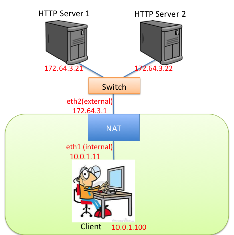

## Introduction 
In this lab assignment you will be writing a simple NAT that can handle ICMP and TCP. It will implement a subset of the functionality specified by RFC5382 and RFC5508. Expect to refer often to these RFCs.

Before beginning this lab, it is crucial that you:
* Understand how NATs work. Consider re-watching the NAT lectures.
* Understand TCP handshake and teardown packet sequences. Consider working through the TCP state diagram.
* Understand NAT Endpoint Independence.
NAT builds on "Simple Router". You should start with your static router code and extend it to include NAT functionality.

As with "Simple Router", we will create a NAT that sits in Mininet between the app servers and the client.  The internal interface of the NAT faces the client, while the external interfaces are connected to app servers. The app servers are "outside" the NAT, while the client is "inside."  

The topology of NAT is as follows, where the NAT's internal interface (eth1) faces the client and its external interface (eth2) has two application servers connected with a switch:




A correct implementation should support the following operations from the emulated client host:

* Pinging the NAT's internal interface from the emulated client host
* Pinging any of the app servers (e.g. 172.64.3.21, 172.64.3.22 above)
* Downloading files using HTTP from the app servers
All packets to external hosts (app servers) should appear to come from eth2's address (e.g. 172.64.3.1 above).


## General NAT Logic
There are three major parts to the assignment:

* translating ICMP echo messages (and their corresponding replies),
* translating TCP packets
* cleaning up defunct mappings between internal addresses and the external address.
Note that your NAT is not required to handle UDP. It is entirely up to you whether you drop or forward UDP traffic.

## Simple Router
Your NAT builds on the "simple router". You must add a new command-line flag, -n, which controls whether the NAT is enabled. If the -n flag is not passed, then the router should act following the requirements of "simple router". For example, it should be possible to traceroute across the router when the -n flag is not passed. All of the ICMP errors in "simple router" still apply. For example, trying to open a TCP port on the router should cause an ICMP port unreachable reply (with the caveat of TCP requirement 4 below). More precisely:

* Your NAT MUST generate and process ICMP messages as per the "simple router".

## ICMP Echo Request/Reply
The first four bytes of an ICMP echo request contain a 16-bit query identifier and a 16-bit sequence number. Because multiple hosts behind the NAT may choose the same identifier and sequence number, the NAT must make their combination globally unique. It needs to maintain the mapping between a globally unique identifier and the corresponding internal address and internal identifier, so that it can rewrite the corresponding ICMP echo reply messages. The first three requirements for your NAT are:

* Your NAT MUST translate ICMP echo requests from internal addresses to external addresses, and MUST correctly translate the corresponding ICMP echo replies.
* ICMP echo requests MUST be external host independent: two requests from the same internal host with the same query identifier to different external hosts MUST have the same external identifier.
* An ICMP query mapping MUST NOT expire less than 60 seconds after its last use. This value MUST be configurable, as described below.

Other "simple router" ICMP behavior should continue to work properly (e.g. responding to an ECHO request from an external host addressed to the NAT's external interface).

## TCP Connections
When an internal host opens a TCP connection to an external host, your NAT must rewrite the packet so that it appears as if it is coming from the NAT's external address. This requires allocating a globally unique port, under a set of restrictions as detailed below. The requirements for your NAT are a subset of those in specified in [RFC5382](https://tools.ietf.org/html/rfc5382); in some cases they are more restrictive. Refer to the RFC for details on the terms used. Your NAT has the following requirements:

* Your NAT MUST have an "Endpoint-Independent Mapping" behavior for TCP.
* Your NAT MUST support all valid sequences of TCP packets (defined in [RFC0793](http://tools.ietf.org/html/rfc793)) for connections initiated both internally as well as externally when the connection is permitted by the NAT. In particular, in addition to handling the TCP 3-way handshake mode of connection initiation, A NAT MUST handle the TCP [simultaneous-open mode of connection initiation](http://ttcplinux.sourceforge.net/documents/one/tcpstate/tcpstate.html).
* Your NAT MUST have an "Endpoint-Independent Filtering" behavior for TCP.
* Your NAT MUST NOT respond to an unsolicited inbound SYN packet for at least 6 seconds after the packet is received. If during this interval the NAT receives and translates an outbound SYN for the connection the NAT MUST silently drop the original unsolicited inbound SYN packet. Otherwise, the NAT MUST send an ICMP Port Unreachable error (Type 3, Code 3) for the original SYN.
If your NAT cannot determine whether the endpoints of a TCP connection are active, it MUST abandon the session if it has been idle for some time. In such cases, the value of the "established connection idle-timeout" MUST NOT be less than 2 hours 4 minutes. The value of the "transitory connection idle-timeout" MUST NOT be less than 4 minutes. This value MUST be configurable, as described below. EDIT: Note you *MUST* timeout idle connections.
* Your NAT MUST NOT have a "Port assignment" behavior of "Port overloading" for TCP.

NOTE: hairpinning for TCP is NOT required. It is up to you whether you support it, or other behavior not required here.


## Mappings
When assigning a port to a mapping, you are free to choose a port any way you choose. The only requirement is that you do not use the well-known ports (0-1023).

As noted above, mappings should be Endpoint Independent. Once a mapping is made between an internal host's (ip, port) pair to an external port in the NAT, any traffic from that host's (ip, port) directed to any external host, and any traffic from any external host to the mapped external port will be rewritten and forwarded accordingly.


### Cleaning up defunct mappings
Your NAT must clean up defunct mappings. Your NAT must periodically timeout both defunct ICMP query sessions and idle TCP connections. Once all connections using a particular mapping are closed or timed out, the mapping should be cleared. Once cleared, a mapping can be reused in new connections.

The periodic function that handles timeouts should fire in its own separate thread (more on threading below). The following three timeout intervals for mappings should be configurable via command-line flags:
* -I INTEGER -- ICMP query timeout interval in seconds (default to 60)
* -E INTEGER -- TCP Established Idle Timeout in seconds (default to 7440)
* -R INTEGER -- TCP Transitory Idle Timeout in seconds (default to 300)

TCP Established Idle Timeout applies to TCP connections in the established (data transfer) state. TCP Transitory Idle Timeout applies to connections in other states (e.g. LISTEN). Refer to the TCP state diagram.

Note: Though the RFCs specify minimum timeout intervals, these are reflected in the defaults. The intervals should be configurable to times below those minimums so that we are able to test your timeout functionality in a reasonable time.

## Implementation Guidance
### Mapping data structure and Concurrency

Mapping state and delaying incoming SYN connections will require a data structure similar to the ARP cache from "simple router". Unlike "simple router", however, in this assignment it is up to you to implement it!

Be sure to study how the ARP cache works. For handling timeouts, a separate thread is spawned (at the top of sr_router.c) that periodically runs. NAT timeouts should have their own thread as well. Because the main forwarding thread and the ARP cache timeout thread share the data structure, the ARP cache accessors and mutators use locks. *Be sure that your NAT's mapping data structure uses locks as well, otherwise nasty concurrency bugs will be sure to crop up*.

In addition, be careful how your mapping table returns mappings, you do not want to hand out pointers to structures that may be freed by the periodic timeout. Take a look at the sr_arpcache_lookup code in the ARP cache.

To get you started on the right track, we provide skeleton code for a possible NAT mapping data structure. 
You will use the same environment that we setup in "simple router" for this assignment. For detailed instructions, please refer to [[Environment Setup]] and [[Simple Router]].

### Download Skeleton Code
Open up a terminal on your machine, download the skeleton code for "NAT" using git.
```no-highlight
> cd ~
> git clone https://huangty@bitbucket.org/huangty/cs144_lab5.git
> cd cs144_lab5
> git checkout --track remotes/origin/standalone
```

The skeleton code resides in router/. The router directory is the starter code for both "Simple Router" and "NAT". If you have implemented "Simple Router", you should make a copy of your "Simple Router" into the NAT directory as follows:
```no-highlight
> pwd
/home/ubuntu/cs144_lab5
> rm router
> cp -r ~/cs144_lab3/router ./
```

Now untar the file sr_nat_table.tar.   Then you will find two files, *sr_nat.c* and *sr_nat.h*. You also need to copy the *rtable* into the directory. 
```no-highlight
> tar xf sr_nat_table.tar
> mv sr_nat.c ./router/
> mv sr_nat.h ./router/
> cp ./rtable ./router/
```

### Test Connectivity of Your Emulated Topology
We also provide a reference implementation (binary) for you to test the environment. 
#### Configure the Environment
First, configure the environment by running the following command.
```no-highlight
> ./config.sh
```
#### Start Mininet
```no-highlight
> ./run_mininet.sh
```
You should see an output that looks like this (except for the IP addresses).
```
*** Removing excess controllers/ofprotocols/ofdatapaths/pings/noxes
killall -9 controller ofprotocol ofdatapath ping nox_core lt-nox_core ovs-openflowd udpbwtest 2> /dev/null
*** Removing junk from /tmp
rm -f /tmp/vconn* /tmp/vlogs* /tmp/*.out /tmp/*.log
*** Removing old screen sessions
*** Removing excess kernel datapaths
ps ax | egrep -o 'dp[0-9]+' | sed 's/dp/nl:/'
***  Removing OVS datapathsovs-vsctl list-br
*** Removing all links of the pattern foo-ethX
ip link show | egrep -o '(\w+-eth\w+)'
*** Cleanup complete.
*** Shutting down stale SimpleHTTPServers  
*** Shutting down stale webservers  
server1 172.64.3.21
server2 172.64.3.22
client 10.0.1.100
sw0-eth1 10.0.1.1
sw0-eth2 172.64.3.1
*** Successfully loaded ip settings for hosts
 {'sw0-eth1': '10.0.1.1', 'sw0-eth2': '172.64.3.1', 'client': '10.0.1.100', 'server1': '172.64.3.21', 'server2': '172.64.3.22'}
*** Creating network
*** Creating network
*** Adding controller
*** Adding hosts:
client server1 server2 
*** Adding switches:
sw0 sw1 
*** Adding links:
(client, sw0) (server1, sw1) (server2, sw1) (sw0, sw1) 
*** Configuring hosts
client server1 server2 
*** Starting controller
*** Starting 2 switches
sw0 sw1 
*** setting default gateway of host server1
server1 172.64.3.1
*** setting default gateway of host server2
server2 172.64.3.1
*** setting default gateway of host client
client 10.0.1.1
*** Starting SimpleHTTPServer on host server1 
*** Starting SimpleHTTPServer on host server2 
*** Starting CLI:
mininet> 
```
#### Start POX
Start the Mininet controller (and wait for it to print some messages)
```no-highlight
> ./run_pox.sh
```

It will print messages that look like this:
```
POX 0.0.0 / Copyright 2011 James McCauley
DEBUG:.home.ubuntu.cs144_lab5.pox_module.cs144.ofhandler:*** ofhandler: Successfully loaded ip settings for hosts
 {'sw0-eth1': '10.0.1.1', 'sw0-eth2': '172.64.3.1', 'client': '10.0.1.100', 'server1': '172.64.3.21', 'server2': '172.64.3.22'}

INFO:.home.ubuntu.cs144_lab5.pox_module.cs144.srhandler:created server
DEBUG:.home.ubuntu.cs144_lab5.pox_module.cs144.srhandler:SRServerListener listening on 8888
DEBUG:core:POX 0.0.0 going up...
DEBUG:core:Running on CPython (2.7.3/Aug 1 2012 05:14:39)
INFO:core:POX 0.0.0 is up.
This program comes with ABSOLUTELY NO WARRANTY.  This program is free software,
and you are welcome to redistribute it under certain conditions.
Type 'help(pox.license)' for details.
DEBUG:openflow.of_01:Listening for connections on 0.0.0.0:6633
Ready.
POX> 
```

** Wait until you see an output like this: **
```
INFO:openflow.of_01:[Con 2/200700410285122] Connected to b6-89-34-a9-4c-42
DEBUG:.home.ubuntu.cs144_lab5.pox_module.cs144.ofhandler:Connection [Con 2/200700410285122]
DEBUG:.home.ubuntu.cs144_lab5.pox_module.cs144.srhandler:SRServerListener catch RouterInfo even, info={'eth2': ('172.64.3.1', 'a6:ba:65:48:2b:ab', '10Gbps', 2), 'eth1': ('10.0.1.1', '76:45:55:d3:66:e5', '10Gbps', 1)}, rtable=[('10.0.1.100', '10.0.1.100', '255.255.255.255', 'eth1'), ('172.64.3.21', '172.64.3.21', '255.255.255.255', 'eth2'), ('172.64.3.22', '172.64.3.22', '255.255.255.255', 'eth2')]
INFO:openflow.of_01:[Con 1/1] Connected to 00-00-00-00-00-01
DEBUG:.home.ubuntu.cs144_lab5.pox_module.cs144.ofhandler:Connection [Con 1/1]
INFO:.home.ubuntu.cs144_lab5.pox_module.cs144.ofhandler:Creating learning switch 00-00-00-00-00-01
```

#### Start Reference Solution
```no-highlight
> ./sr_nat -n
```
Note that “-n” means NAT is enabled.  You should see an output like this:

```
Using VNS sr stub code revised 2009-10-14 (rev 0.20)
Loading routing table from server, clear local routing table.
Loading routing table
---------------------------------------------
Destination	Gateway		Mask	Iface
10.0.1.100		10.0.1.100	255.255.255.255	eth1
172.64.3.21		172.64.3.21	255.255.255.255	eth2
172.64.3.22		172.64.3.22	255.255.255.255	eth2
172.64.3.22		172.64.3.22	255.255.255.255	eth2
---------------------------------------------
Client ubuntu connecting to Server localhost:8888
Requesting topology 0
successfully authenticated as ubuntu
Loading routing table from server, clear local routing table.
Loading routing table
---------------------------------------------
Destination	Gateway		Mask	Iface
10.0.1.100		10.0.1.100	255.255.255.255	eth1
172.64.3.21		172.64.3.21	255.255.255.255	eth2
172.64.3.22		172.64.3.22	255.255.255.255	eth2
172.64.3.22		172.64.3.22	255.255.255.255	eth2
---------------------------------------------
Router interfaces:
eth2	HWaddra6:ba:65:48:2b:ab
	inet addr 172.64.3.1
eth1	HWaddr76:45:55:d3:66:e5
	inet addr 10.0.1.1
 <-- Ready to process packets --> 
```


To see whether the NAT is doing the translation, let’s do a tcpdump at server1 and observe the packet is going to be received at the server 1. To do so, go to the terminal where you run the Mininet, type the following command in the Mininet command line interface (CLI) to bring up the terminal of server1.
```no-highlight
mininet> xterm server1
```

Then in the server1 terminal:
```no-highlight
> tcpdump -n -i server1-eth0
```

Now, back to the Mininet CLI to send some ping packets from client to server1:
```no-highlight
mininet> client ping -c 3 172.64.3.21
```

On the Mininet CLI, you should be able to see the following output:
```
PING 172.64.3.21 (172.64.3.21) 56(84) bytes of data.
64 bytes from 172.64.3.21: icmp_req=1 ttl=63 time=283 ms
64 bytes from 172.64.3.21: icmp_req=2 ttl=63 time=52.1 ms
64 bytes from 172.64.3.21: icmp_req=3 ttl=63 time=78.9 ms
```

On the server1 terminal, you should be able to see the following output:
```
tcpdump: verbose output suppressed, use -v or -vv for full protocol decode
listening on server1-eth0, link-type EN10MB (Ethernet), capture size 65535 bytes
18:55:41.959989 ARP, Request who-has 172.64.3.21 (ff:ff:ff:ff:ff:ff) tell 172.64.3.1, length 28
18:55:41.960014 ARP, Reply 172.64.3.21 is-at ce:e6:0f:ed:52:aa, length 28
18:55:42.029448 IP 172.64.3.1 > 172.64.3.21: ICMP echo request, id 1050, seq 1, length 64
18:55:42.029472 IP 172.64.3.21 > 172.64.3.1: ICMP echo reply, id 1050, seq 1, length 64
18:55:42.863084 IP 172.64.3.1 > 172.64.3.21: ICMP echo request, id 1050, seq 2, length 64
18:55:42.863103 IP 172.64.3.21 > 172.64.3.1: ICMP echo reply, id 1050, seq 2, length 64
18:55:43.881834 IP 172.64.3.1 > 172.64.3.21: ICMP echo request, id 1050, seq 3, length 64
18:55:43.881850 IP 172.64.3.21 > 172.64.3.1: ICMP echo reply, id 1050, seq 3, length 64
18:55:47.036590 ARP, Request who-has 172.64.3.1 tell 172.64.3.21, length 28
18:55:47.071261 ARP, Reply 172.64.3.1 is-at a6:ba:65:48:2b:ab, length 28
```

Note the packets received at server1 is from *172.64.3.1*, which is the IP of NAT's external interface, instead of 10.0.1.100, the IP of the client host. 

Now, let’s disable NAT and compare. Back to the terminal where you run “./sr_nat -n”, use control-c to stop the current “./sr_nat -n” process, and run the following command
```no-highlight
> ./sr_nat 
```
Also using tcpdump on server1's terminal to see the packets reaches server1:
```no-highlight
> server1 tcpdump -n -i server1-eth0
```
You should be able to see the following output:
```
tcpdump: verbose output suppressed, use -v or -vv for full protocol decode
listening on server1-eth0, link-type EN10MB (Ethernet), capture size 65535 bytes
19:04:35.911619 ARP, Request who-has 172.64.3.21 (ff:ff:ff:ff:ff:ff) tell 172.64.3.1, length 28
19:04:35.911650 ARP, Reply 172.64.3.21 is-at ce:e6:0f:ed:52:aa, length 28
19:04:35.984895 IP 10.0.1.100 > 172.64.3.21: ICMP echo request, id 3392, seq 1, length 64
19:04:35.984921 IP 172.64.3.21 > 10.0.1.100: ICMP echo reply, id 3392, seq 1, length 64
19:04:36.868670 IP 10.0.1.100 > 172.64.3.21: ICMP echo request, id 3392, seq 2, length 64
19:04:36.868697 IP 172.64.3.21 > 10.0.1.100: ICMP echo reply, id 3392, seq 2, length 64
19:04:37.889304 IP 10.0.1.100 > 172.64.3.21: ICMP echo request, id 3392, seq 3, length 64
19:04:37.889321 IP 172.64.3.21 > 10.0.1.100: ICMP echo reply, id 3392, seq 3, length 64
19:04:40.988598 ARP, Request who-has 172.64.3.1 tell 172.64.3.21, length 28
19:04:41.023814 ARP, Reply 172.64.3.1 is-at a6:ba:65:48:2b:ab, length 28
```
This time, since the NAT is disabled, the source IP shows the client's IP (10.0.1.100) instead. 

This assignment would require some thread programming. If you do not have thread programming experience, then Lectures 9, 10, and 13 of [Stanford CS110](http://www.stanford.edu/class/cs110/) might be helpful introductions. There are also many resources on the web explaining why and when systems use them. Finally, there are lots of good [pthreads tutorials](https://computing.llnl.gov/tutorials/pthreads/) on the web, for concrete programming guidance. You can also use the ARP cache code as a guide. Since this isn't a high performance system, it's better to be conservative with your locks; a race condition is much harder to debug than a deadlock.


### Tracking Connections
You do not need to keep lots of state per connection. For example, there is no need to track seqnos or window values or ensure TCP packets are in proper order to the end hosts. Keep only the information that is useful to the NAT for establishing or clearing mappings.

When rewriting TCP packets, remember to update the checksum (over the pseudo-header, tcp header, and payload). The TCP checksum is calculated like the IP checksum, so you can reuse the cksum function. Note that if the checksum is incorrect when the packet comes in, you can drop it; you should not "correct the checksum" as that would hide potential attackers or errors.

### Adding command-line flags

You must add the following command-line flags to sr_main.c:
* -n         -- Enable NAT functionality
* -I INTEGER -- ICMP query timeout interval in seconds (default to 60)
* -E INTEGER -- TCP Established Idle Timeout in seconds (default to 7440)
* -R INTEGER -- TCP Transitory Idle Timeout in seconds (default to 300)

Make sure to adjust the parameter to getopt, and add the proper cases.  getopt() is a useful C library call to parse a list of arguments passed to your program.  Here is a good tutorial on using getopt: [Command line processing using getopt()](http://www.ibm.com/developerworks/aix/library/au-unix-getopt.html).

For example, starting your NAT with:
```no-highlight
> ./sr -s localhost -p 8888 -n -I 70 -R 40
```
It would enable NAT functionality, timeout ICMP mappings after 70 seconds, TCP mappings with at least one established connection after 7440 seconds, and TCP mappings with only transitory connections after 40 seconds.

## Reference Implementation
A reference implementation (binary), _sr_nat_ , is available along with the start code.


 
