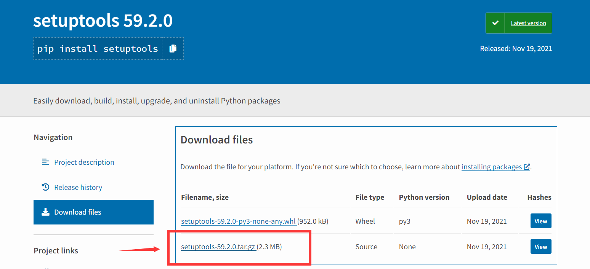
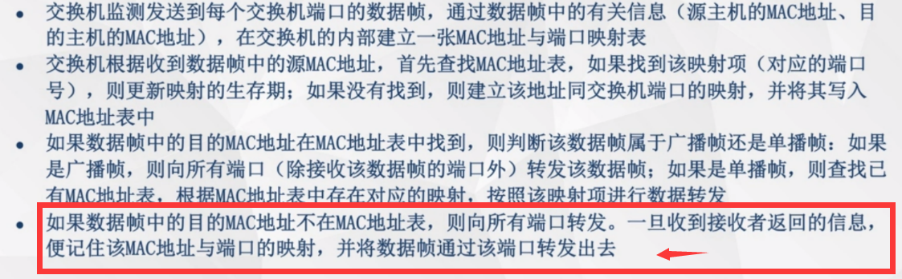
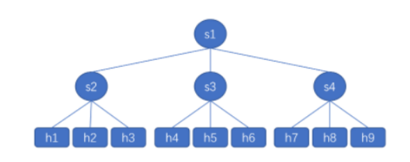
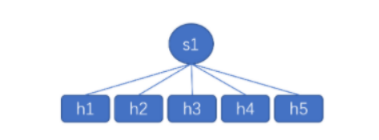
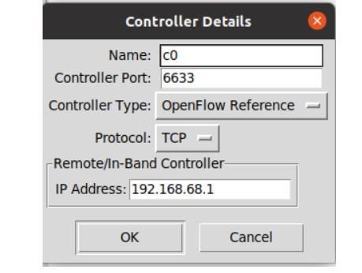
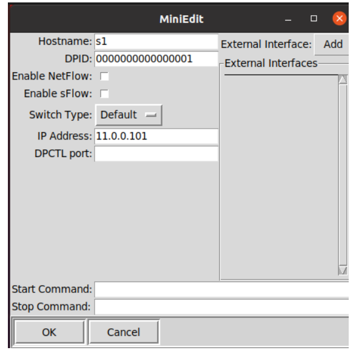
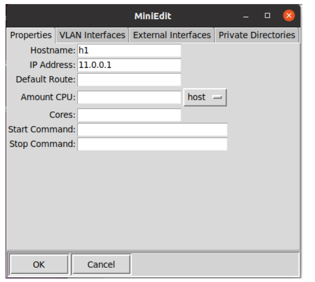
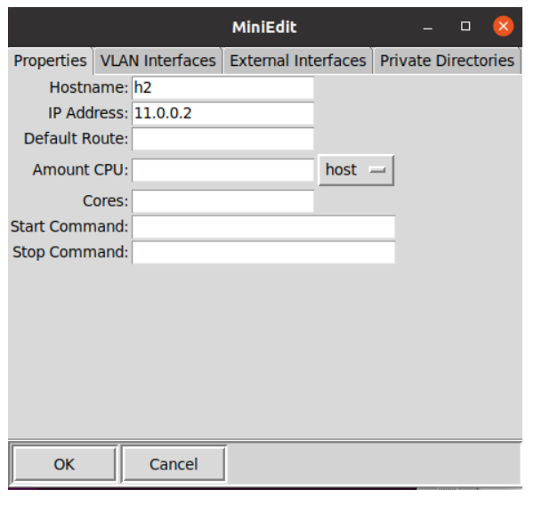
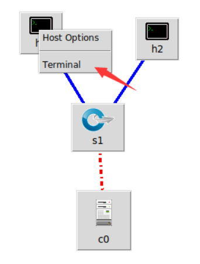
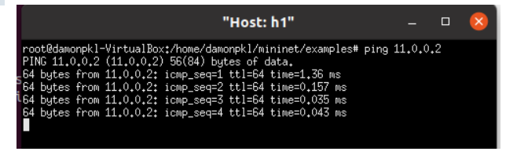

# Mininet的搭建和学习笔记

author:Damon

参考资料：**Mininet**安裝教學

### 前言：

**第六章有关于Mininet的搭建和学习笔记。**

**这里省略mininet安装的步骤和miniedit.py的基本使用**

花了半个小时发现我和老师第六章的配置不同。

上次没有使用老师我是觉得老师的文件有点老，然后就网上看了一些教程跟着敲了。

那第七章和第六章一个是基于同一教学文件，所以得从第六章开始重新配置

按着老师的配置弄了2个多小时发现，很多包都是基于python2。

所以我会将前面放一些自己的遇到错误的源码，那后面因为太多包要弄了，最后还是选择看网络的一些部署的，方便自己了解什么是mininet，交换机与主机之间的通信等


### 练习1：


下列是我的配置源码，基于ubuntu20.4环境：

仅供参考，后面要弄的包属实太多了

```shell
#第六章的重新配置
ubuntu20@ubuntu:~$ sudo apt install git
[sudo] password for ubuntu20: 
Reading package lists... Done
...
...
ubuntu20@ubuntu:~/Desktop$ cd ~
ubuntu20@ubuntu:~$ git clone https://huangty@bitbucket.org/huangty/cs144_lab3.git
Cloning into 'cs144_lab3'...
Receiving objects: 100% (207/207), 95.08 KiB | 419.00 KiB/s, done.
Resolving deltas: 100% (91/91), done.
ubuntu20@ubuntu:~/Desktop$ cd ~
ubuntu20@ubuntu:~$ git clone https://huangty@bitbucket.org/huangty/cs144_lab3.git
Cloning into 'cs144_lab3'...
Receiving objects: 100% (207/207), 95.08 KiB | 419.00 KiB/s, done.
Resolving deltas: 100% (91/91), done.
ubuntu20@ubuntu:~$ cd cs144_lab3/
ubuntu20@ubuntu:~/cs144_lab3$ git checkout --track remotes/origin/standalone
Branch 'standalone' set up to track remote branch 'standalone' from 'origin'.
Switched to a new branch 'standalone'
ubuntu20@ubuntu:~/cs144_lab3$ ./config.sh 
sudo: python: command not found
##别慌，下载多一个python就好了

ubuntu20@ubuntu:~/cs144_lab3$ sudo apt-get install python
Reading package lists... Done
Building dependency tree       
Reading state information... Done
...
...
...
ubuntu20@ubuntu:~/cs144_lab3$ ./config.sh 
Traceback (most recent call last):
  File "setup.py", line 4, in <module>
    from setuptools import setup, find_packages
ImportError: No module named setuptools
##python2就是很多东西不全
ubuntu20@ubuntu:~/cs144_lab3$ pip install setupstools

Command 'pip' not found, but there are 18 similar ones.
##那得从python3开始改。
ubuntu20@ubuntu:~/cs144_lab3$ sudo apt-get install python3-pip
Reading package lists... Done
Building dependency tree       
Reading state information... Done
The following additional packages will be installed:
...
...
...
##有两种方法，
##第一种就是弄那个什么软连接硬连接，我觉得个人觉得好麻烦，我一般虚拟机用一台删一台。
##第二种就是直接下载相关的包，导入到电脑里进行解压
##网站就是：https://pypi.org/project/setuptools/#files
```




```shell
#为了方便，wget方式直接自动下载到大家的桌面
ubuntu20@ubuntu:~$ wget https://pypi.python.org/packages/45/29/8814bf414e7cd1031e1a3c8a4169218376e284ea2553cc0822a6ea1c2d78/setuptools-36.6.0.zip#md5=74663b15117d9a2cc5295d76011e6fd1
...
...
ubuntu20@ubuntu:~$ unzip setuptools-36.6.0.zip 
Archive:  setuptools-36.6.0.zip
  inflating: setuptools-36.6.0/CHANGES.rst  
  inflating: setuptools-36.6.0/LICENSE  
  inflating: setuptools-36.6.0/MANIFEST.in  
  inflating: setuptools-36.6.0/README.rst  
  inflating: setuptools-36.6.0/bootstrap.py  
  inflating: setuptools-36.6.0/conftest.py  
  inflating: setuptools-36.6.0/easy_install.py 

ubuntu20@ubuntu:~/cs144_lab3$ ./config.sh
running develop
running egg_info
writing requirements to cs144.egg-info/requires.txt
writing cs144.egg-info/PKG-INFO
writing top-level names to cs144.egg-info/top_level.txt
writing dependency_links to cs144.egg-info/dependency_links.txt
reading manifest file 'cs144.egg-info/SOURCES.txt'
writing manifest file 'cs144.egg-info/SOURCES.txt'
running build_ext
Creating /usr/local/lib/python2.7/dist-packages/cs144.egg-link (link to .)
cs144 0.0.0 is already the active version in easy-install.pth

Installed /home/ubuntu20/cs144_lab3/pox_module
Processing dependencies for cs144==0.0.0
Searching for ltprotocol
Reading https://pypi.python.org/simple/ltprotocol/
Couldn't find index page for 'ltprotocol' (maybe misspelled?)
Scanning index of all packages (this may take a while)
Reading https://pypi.python.org/simple/
No local packages or working download links found for ltprotocol
error: Could not find suitable distribution for Requirement.parse('ltprotocol')
##基于python2真难搞，不知道是不是还有很多包要去安装。这个练习就做到这。
##大概看了一下老师原文后面的操作无非就是说通过EVe这个小偷，偷听Alice和Bob的通信。具体的原理简单来说就是通过溢出的地址发送广播，所以a和b肯定能接收到信息，然后连ip地址都知道了，那他们如果通信的话是可以监听的。这里引入一张关于交换机通信的原理表

```




### 网上简易教程


```shell
#这里我还是用自己以前的mininet,老师那个属实有些不会。
```

基本命令

|   命令   |               功能                |   命令    |               功能                |
| :------: | :-------------------------------: | :-------: | :-------------------------------: |
|   help   |           打印帮助信息            |   nodes   |         查看全部节点信息          |
|  xterm   |           打开xterm窗口           |    net    |         查看网络拓扑信息          |
|   ping   |      h1 ping h2 ，测试连通性      |   dump    |           输出节点信息            |
|  iperf   |         指定节点间TCP测试         | iperdudp  | 指定节点间UDP测试，可指定发送速率 |
|    py    |          运行python语句           |    sh     |           执行shell脚本           |
| host cmd | 在主机中执行命令，例：h1 ifconfig | exit/quit |            退出Mininet            |

### 简单实战mininet

```shell
damonpkl@damonpkl-VirtualBox:~$ sudo mn
*** Creating network
*** Adding controller
*** Adding hosts:
h1 h2 
*** Adding switches:
s1 
*** Adding links:
(h1, s1) (h2, s1) 
*** Configuring hosts
h1 h2 
*** Starting controller
c0 
*** Starting 1 switches
s1 ...
*** Starting CLI:
#也就是说建立了两个主机（h1,h2）在同一个交换机(s1)下
mininet> net
h1 h1-eth0:s1-eth1
h2 h2-eth0:s1-eth2
s1 lo:  s1-eth1:h1-eth0 s1-eth2:h2-eth0
c0
#第一种结构，主要看net
damonpkl@damonpkl-VirtualBox:~$ sudo mn --topo=tree,2,3
\*** Creating network
*** Adding controller
*** Adding hosts:
h1 h2 h3 h4 h5 h6 h7 h8 h9 
*** Adding switches:
s1 s2 s3 s4 
*** Adding links:
(s1, s2) (s1, s3) (s1, s4) (s2, h1) (s2, h2) (s2, h3) (s3, h4) (s3, h5) (s3, h6) (s4, h7) (s4, h8) (s4, h9) 
*** Configuring hosts
h1 h2 h3 h4 h5 h6 h7 h8 h9 
*** Starting controller
c0 
*** Starting 4 switches
s1 s2 s3 s4 ...
*** Starting CLI:
mininet> net
h1 h1-eth0:s2-eth1
h2 h2-eth0:s2-eth2
h3 h3-eth0:s2-eth3
h4 h4-eth0:s3-eth1
h5 h5-eth0:s3-eth2
h6 h6-eth0:s3-eth3
h7 h7-eth0:s4-eth1
h8 h8-eth0:s4-eth2
h9 h9-eth0:s4-eth3
s1 lo:  s1-eth1:s2-eth4 s1-eth2:s3-eth4 s1-eth3:s4-eth4
s2 lo:  s2-eth1:h1-eth0 s2-eth2:h2-eth0 s2-eth3:h3-eth0 s2-eth4:s1-eth1
s3 lo:  s3-eth1:h4-eth0 s3-eth2:h5-eth0 s3-eth3:h6-eth0 s3-eth4:s1-eth2
s4 lo:  s4-eth1:h7-eth0 s4-eth2:h8-eth0 s4-eth3:h9-eth0 s4-eth4:s1-eth3
c0
#结构如下图所示


```



```shell
#第二种结构,看net
damonpkl@damonpkl-VirtualBox:~$ sudo mn --topo=single,5
*** Creating network
*** Adding controller
*** Adding hosts:
h1 h2 h3 h4 h5 
*** Adding switches:
s1 
*** Adding links:
(h1, s1) (h2, s1) (h3, s1) (h4, s1) (h5, s1) 
*** Configuring hosts
h1 h2 h3 h4 h5 
*** Starting controller
c0 
*** Starting 1 switches
s1 ...
*** Starting CLI:
mininet> net
h1 h1-eth0:s1-eth1
h2 h2-eth0:s1-eth2
h3 h3-eth0:s1-eth3
h4 h4-eth0:s1-eth4
h5 h5-eth0:s1-eth5
s1 lo:  s1-eth1:h1-eth0 s1-eth2:h2-eth0 s1-eth3:h3-eth0 s1-eth4:h4-eth0 s1-eth5:h5-eth0
c0
#结构如下图所示
```



```shell
#可视化操作
##检查python安装环境
damonpkl@damonpkl-VirtualBox:~/Desktop$ python3 --version
Python 3.8.10
damonpkl@damonpkl-VirtualBox:~/Desktop$ whereis python3
python3: /usr/bin/python3.8 /usr/bin/python3 /usr/bin/python3.8-config /usr/lib/python3.9 /usr/lib/python3.8 /usr/lib/python3 /etc/python3.8 /etc/python3 /usr/local/lib/python3.8 /usr/include/python3.8 /usr/share/python3 /usr/share/man/man1/python3.1.gz
damonpkl@damonpkl-VirtualBox:~/Desktop$ sudo ln -s /usr/bin/python3 /usr/bin/python
[sudo] password for damonpkl: 
damonpkl@damonpkl-VirtualBox:~$ cd mininet
damonpkl@damonpkl-VirtualBox:~/mininet$ ls
bin           debian    INSTALL   mininet  mnexec.1   setup.py
CONTRIBUTORS  doc       LICENSE   mn.1     mnexec.c   util
custom        examples  Makefile  mnexec   README.md
damonpkl@damonpkl-VirtualBox:~/mininet$ cd examples/
damonpkl@damonpkl-VirtualBox:~/mininet/examples$ ls
baresshd.py       controlnet.py       mobility.py       README.md
bind.py           cpu.py              multilink.py      scratchnet.py
clustercli.py     emptynet.py         multiping.py      scratchnetuser.py
clusterdemo.py    hwintf.py           multipoll.py      simpleperf.py
clusterperf.py    __init__.py         multitest.py      sshd.py
cluster.py        intfoptions.py      natnet.py         test
clusterSanity.py  limit.py            nat.py            tree1024.py
consoles.py       linearbandwidth.py  numberedports.py  treeping64.py
controllers2.py   linuxrouter.py      popenpoll.py      vlanhost.py
controllers.py    miniedit.py         popen.py
damonpkl@damonpkl-VirtualBox:~/mininet/examples$ sudo ./miniedit.py 

#打开界面如下
可以看出左侧的工具栏中的工具，第一个简体，第二个代表主机，第三个代表sdn交换机，第四个代表普通交换机，第五个代表路由器，第六个是线路，第七个代表控制器。
```


修改参数，让两台主机相连
















```shell
#尝试h1能否和h2ping通
ping 11.0.0.2 -c 3
```


