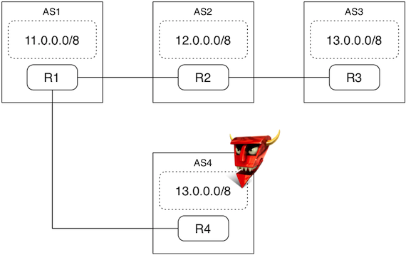

### Introduction

In this exercise, you are going to recreate a "BGP path hijacking attack" inside Mininet.

Recall that the Internet predominantly consists of interconnected Autonomous Systems (ASes) that exchange routing information with each other using a common protocol called the Border Gateway Protocol (BGP).

The goal of this exercise is to safely demonstrate a specific attack that was possible using BGP, in which a rogue AS falsely advertises a shorter path to reach a prefix P, which causes other AS'es to route traffic destined to the prefix P through the shorter path.

You can check more information about this attack, other similar attacks, and possible defenses in this presentation: http://www.slideshare.net/dyninc/bgp-prefix-hijack-defense-at-nanog-46.

## Setup
We will create the following network topology shown in the figure below.  There are four AS's: AS1, AS2, AS3 and AS4 (rogue).  Each AS has its own routing daemon shown as R1, R2, R3 and R4.  Each routing daemon's peers are shown using connections:

1. R1 peers with R2 and R4.
2. R2 peers with R1 and R3.
3. R3 peers with R2.



## How does the experiment work in Mininet?
1. We create a container for each AS node.  Each container has a routing daemon. We use the open-source routing daemon suite quagga.  In particular, each AS runs bgpd for talking BGP, and zebra for configuring routing entries in the Linux kernel.

2. The configuration for each AS is stored in the conf directory.

3. Since Mininet uses network namespaces, each container's routing tables are isolated from one another.  Therefore, changes inside AS1's routing tables will not affect AS2's routing table.

4. The AS's are connected to each other through separate network interfaces through static routing entries.  R1's IP address is 9.0.0.1, R2's is 9.0.0.2, etc.

# Demo Instructions
## Step 1
1. Ensure you have downloaded the Mininet VM installation from http://www.scs.stanford.edu/~jvimal/mininet-sigcomm14/mininet-tutorial-vm-64bit.zip.  Note: The tutorial is known to not work with recent versions of Mininet.  Until we fix the issue and update this Wiki entry, please use the VM from the above URL.  The username/password is mininet/mininet.
2. `git clone git@bitbucket.org:jvimal/bgp.git`.
3. `cd bgp`
4. Start the bgp experiment and wait for the Mininet prompt by running the python command as shown below:

```
mininet@mininet-vm:~/bgp$ sudo python bgp.py
*** Creating network
*** Adding controller
*** Adding hosts:
h1-1 h1-2 h1-3 h2-1 h2-2 h2-3 h3-1 h3-2 h3-3 h4-1 h4-2 h4-3
*** Adding switches:
R1 R2 R3 R4
*** Adding links:
(R1, R2) (R1, R4) (R1, h1-1) (R1, h1-2) (R1, h1-3) (R2, R3) (R2, h2-1) (R2, h2-2) (R2, h2-3) (R3, h3-1) (R3, h3-2) (R3, h3-3) (R4, h4-1) (R4, h4-2) (R4, h4-3)
*** Configuring hosts
h1-1 h1-2 h1-3 h2-1 h2-2 h2-3 h3-1 h3-2 h3-3 h4-1 h4-2 h4-3
*** Starting controller
*** Starting 4 switches
R1 R2 R3 R4
Waiting 3 seconds for sysctl changes to take effect...
Starting zebra and bgpd on R1
Starting zebra and bgpd on R2
Starting zebra and bgpd on R3
Starting web servers
*** Starting CLI:
mininet>
```

Keep this shell running throughout this demonstration.

## Step 2
In another terminal, let's start a session with AS1's routing daemon:
```
mininet@mininet-vm:~/bgp$ ./connect.sh
Connecting to R1 shell
Trying ::1...
Connected to localhost.
Escape character is '^]'.

Hello, this is Quagga (version 0.99.22.4).
Copyright 1996-2005 Kunihiro Ishiguro, et al.


User Access Verification

Password: (type password "en" (without quotes))
Now, type the "en" command to get to the admin shell:
bgpd-R1> en
Password: (type password "en" (without quotes))
bgpd-R1#
```

## Step 3
Let's see AS1's routing entries.  If you type the command `sh ip bgp`, you should see an output like this:

```
bgpd-R1# sh ip bgp
BGP table version is 0, local router ID is 9.0.0.1
Status codes: s suppressed, d damped, h history, * valid, > best, i - internal,
              r RIB-failure, S Stale, R Removed
Origin codes: i - IGP, e - EGP, ? - incomplete

   Network          Next Hop            Metric LocPrf Weight Path
*> 11.0.0.0         0.0.0.0                  0         32768 i
*> 12.0.0.0         9.0.0.2                  0             0 2 i
*> 13.0.0.0         9.0.0.2                                0 2 3 i

Total number of prefixes 3
```

Notice that on AS1, the chosen AS path to reach 13.0.0.0/8 is "2 3" (i.e., via AS2 and AS3).

## Step 4
Keep the above shell running in a separate window.  Now, let's visit a default web server that Mininet started in AS3 and verify that we can reach it from host h1-1 connected to AS1.  We're going to run the command "curl -s 13.0.1.1" from AS1 in a loop.  We have created a script "website.sh" that does this for you automatically:

```
mininet@mininet-vm:~/bgp$ ./website.sh
Sun Aug 10 09:56:39 PDT 2014 -- <h1>Default web server</h1>
Sun Aug 10 09:56:40 PDT 2014 -- <h1>Default web server</h1>
Sun Aug 10 09:56:41 PDT 2014 -- <h1>Default web server</h1>
...
```

## Step 5

Now, in another window, let us start the rogue AS using the command "./start_rogue.sh".  The rogue AS will connect to AS1 and advertise a route to 13.0.0.0/8 using a shorter path (i.e., a direct path from AS1 to AS4).  Thus, AS1 will choose this shorter path by default.

```
mininet@mininet-vm:~/bgp$ ./start_rogue.sh
Killing any existing rogue AS
Starting rogue AS
```

After some time (for BGP convergence), you should see the output of website.sh script change:
```
Sun Aug 10 10:00:36 PDT 2014 -- <h1>Default web server</h1>
Sun Aug 10 10:00:37 PDT 2014 -- <h1>Default web server</h1>
Sun Aug 10 10:00:38 PDT 2014 -- <h1>Default web server</h1>
Sun Aug 10 10:00:39 PDT 2014 -- <h1>*** Attacker web server ***</h1>
Sun Aug 10 10:00:40 PDT 2014 -- <h1>*** Attacker web server ***</h1>
Sun Aug 10 10:00:41 PDT 2014 -- <h1>*** Attacker web server ***</h1>
```

You can also inspect the routing table using the shell you started in step 2.  If the shell closed (due to inactivity), you can start it again (see step 2).

```
bgpd-R1# sh ip bgp
BGP table version is 0, local router ID is 9.0.0.1
Status codes: s suppressed, d damped, h history, * valid, > best, i - internal,
              r RIB-failure, S Stale, R Removed
Origin codes: i - IGP, e - EGP, ? - incomplete

   Network          Next Hop            Metric LocPrf Weight Path
*> 11.0.0.0         0.0.0.0                  0         32768 i
*> 12.0.0.0         9.0.0.2                  0             0 2 i
*> 13.0.0.0         9.0.4.2                  0             0 4 i
*                   9.0.0.2                                0 2 3 i

Total number of prefixes 3

You can see AS4's chosen path and also AS3's path in the routing information base of AS1.  Since the AS path length to reach 13.0.0.0/8 is smaller through AS4, R1 chooses AS4 as its next hop.
```

## Step 6

You can stop the attack by killing R4's routing daemon.  You will notice that convergence is quick: the traffic is almost immediately redirected to the legitimate web server.

```
mininet@mininet-vm:~/bgp$ ./stop_rogue.sh
<switch to the other terminal>

mininet@mininet-vm:~/bgp$ ./website.sh
Sun Aug 10 10:08:15 PDT 2014 -- <h1>*** Attacker web server ***</h1>
Sun Aug 10 10:08:16 PDT 2014 -- <h1>*** Attacker web server ***</h1>
<R4 killed at this point>
Sun Aug 10 10:08:17 PDT 2014 -- <h1>Default web server</h1>
Sun Aug 10 10:08:18 PDT 2014 -- <h1>Default web server</h1>
Sun Aug 10 10:08:19 PDT 2014 -- <h1>Default web server</h1>
```

## Step 7

You can stop the experiment by typing "exit" at the mininet prompt, Control-C in the window where you started the website, and type "exit" in the terminal where you connected to R1's terminal.

```
mininet> exit
*** Stopping 4 switches
R1 .....R2 .....R3 ....R4 ....
*** Stopping 12 hosts
h1-1 h1-2 h1-3 h2-1 h2-2 h2-3 h3-1 h3-2 h3-3 h4-1 h4-2 h4-3
*** Stopping 1 controllers
c0
*** Done
```

That is it!

# Demo content

1. Slides from SIGCOMM 2014 Mininet tutorial: (Coming soon!)
2. Code: https://bitbucket.org/jvimal/bgp
