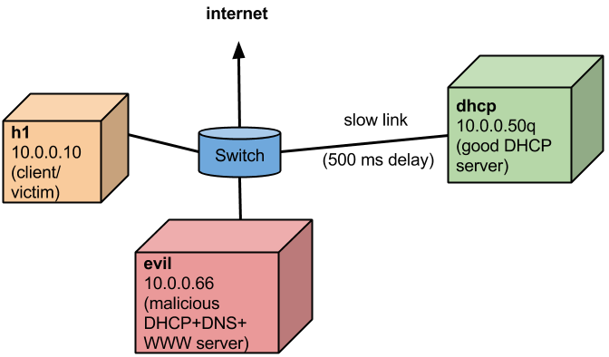

### Introduction

In this demonstration, we construct a simple network to demonstrate a DHCP attack. This is an example of using Mininet to run an experiment that you (usually) wouldn't want to try on a regular network that people are trying to use!

The test network consists of three hosts connected to a single switch:


* `h1` (10.0.0.50) is the "victim" host - a computer which has just connected to the network (for example joining a Wi-Fi network) and is going to make DHCP requests.
* `dhcp` (10.0.0.53) is the "good" DHCP server which provides correct information, but which is connected to the switch by a slower link (500 ms of delay in this example.)
* `evil` (10.0.0.66) is a malicious host which is connected directly to the switch by a fast link; it provides malicious DHCP responses and also hosts a malicious DNS server and malicious DHCP server.

When the victim host `h1` makes the DHCP request, it is forwarded to both `dhcp` and `evil`, but `evil` responds first and its DHCP offer is accepted by the victim. The `evil` DHCP server provides its address as the DNS server address, so the victim sends its DNS requests to the `evil` DNS server, which provides its own IP address rather than the correct IP address for the DNS lookup. The victim then connects to the address of the `evil` web server, which serves its own malicious content, asking the victim for an e-mail address and password.

### Demo Instructions

Make sure Mininet and the Stanford reference OpenFlow controller are installed, and that Mininet's X11 support (e.g. `sudo -E mn -x`) is working correctly.

Download the DHCP demo code if necessary, and start it:

```
git clone https://bitbucket.org/lantz/cs144-dhcp
cd cs144-dhcp
sudo -E ./dhcp.py
*** Creating network
*** Adding controller
*** Adding hosts:
dhcp evil h1 
*** Adding switches:
s1 
*** Adding links:
(10.00Mbit 500ms delay) (10.00Mbit 500ms delay) (dhcp, s1) (evil, s1) (h1, s1) 
*** Configuring hosts
dhcp evil h1 
*** Starting controller
*** Starting 1 switches
s1 (10.00Mbit 500ms delay) 
* Starting DHCP server on dhcp at 10.0.0.50 
* h1 waiting for IP address...
* h1 is now using nameserver 8.8.8.8
* Fetching google.com:
<HTML><HEAD><meta http-equiv="content-type" content="text/html;charset=utf-8">
<TITLE>301 Moved</TITLE></HEAD><BODY>
<H1>301 Moved</H1>
The document has moved
<A HREF="http://www.google.com/">here</A>.
</BODY></HTML>

*** You may want to do some DNS lookups using dig
*** Please go to amazon.com in Firefox
*** You may also wish to start up wireshark and look at bootp and/or dns
*** Press return to start up evil DHCP server:
```

The first time you run the demo, it may try to install required support software, such as `dnsmasq` and `firefox`.

If everything has worked correctly, you will see an `xterm` window for `h1` as well as a Firefox window, which should have loaded `www.stanford.edu`. You can load other sites like `amazon.com` if you like.

Next, in the `h1` window, start up `wireshark`, set it up to observe the `bootp` traffic on interface `h1-eth0`, and start capturing traffic.

Press return to start up the malicious DHCP server:

```
Starting DHCP server on evil at 10.0.0.66 
* Starting fake DNS server evil at 10.0.0.66 
* Starting web server evil at 10.0.0.66 
* h1 waiting for IP address........
* h1 is now using nameserver 10.0.0.66
* New DNS result:
google.com has address 10.0.0.66
*** You may wish to look at DHCP and DNS results in wireshark
*** You may also wish to do some DNS lookups using dig
*** Please go to google.com in Firefox
*** You may also want to try going back to amazon.com and hitting shift-refresh
*** Press return to shut down evil DHCP/DNS/Web servers: 
```

Observe that the malicious DHCP server, 10.0.0.66, responds to the DHCP discover before the good DHCP server, 10.0.0.50, and the client responds to `evil`'s offer, making a DHCP request which is ACKed with the malicious DNS IP address, 10.0.0.66.

Next, you can try some DNS lookups (e.g. using `dig`) or try to go to web sites in Firefox. You may have to press shift-refresh to cause Firefox to make a new DNS request. Observe that the malicious DNS server replies with the address of the malicious web server, causing Firefox to load the malicious web page instead of the desired page.

Finally, press return to shut down the evil DHCP/DNS/web servers:

```
* Stopping fake DNS server evil at 10.0.0.66 
* Stopping web server evil at 10.0.0.66 
* Stopping DHCP server on evil at 10.0.0.66 
*** Try going to some other web sites if you like
*** Press return to exit: 
```
After the malicious servers are shut down, things return to normal - DHCP requests go to the good DHCP server, which responds with the good DNS server address, which responds with correct DNS lookups.

Press return to exit the demo.

```
* Stopping DHCP server on dhcp at 10.0.0.50 
*** Stopping 1 controllers
c0 
*** Stopping 2 terms
*** Stopping 1 switches
s1 ....
*** Stopping 4 links

*** Stopping 3 hosts
dhcp evil h1 
*** Done
```

### Code

The code is available via `git`:

    git clone https://bitbucket.org/lantz/cs144-dhcp

### Video

A video of the DHCP attack demo is available at:

https://bitbucket.org/lantz/cs144-dhcp/downloads/firefox-dhcp-4-720p.mov

備用視頻地址：
https://cityuedumo-my.sharepoint.com/:v:/g/personal/andylau_cityu_mo/ERxT7uQp9GpOis5auByGo48BP9HeJ6296w2YYf2Hk1fr4Q?e=QqZpsl 
